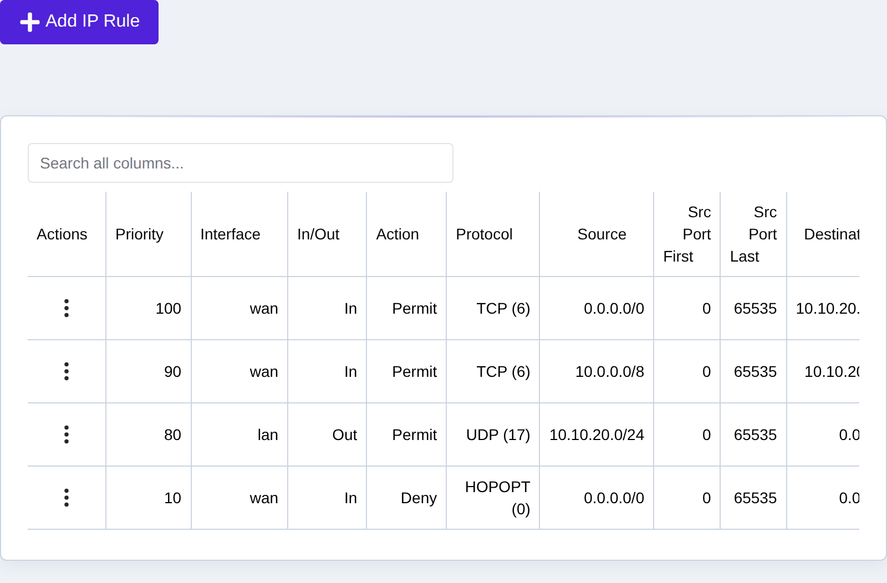
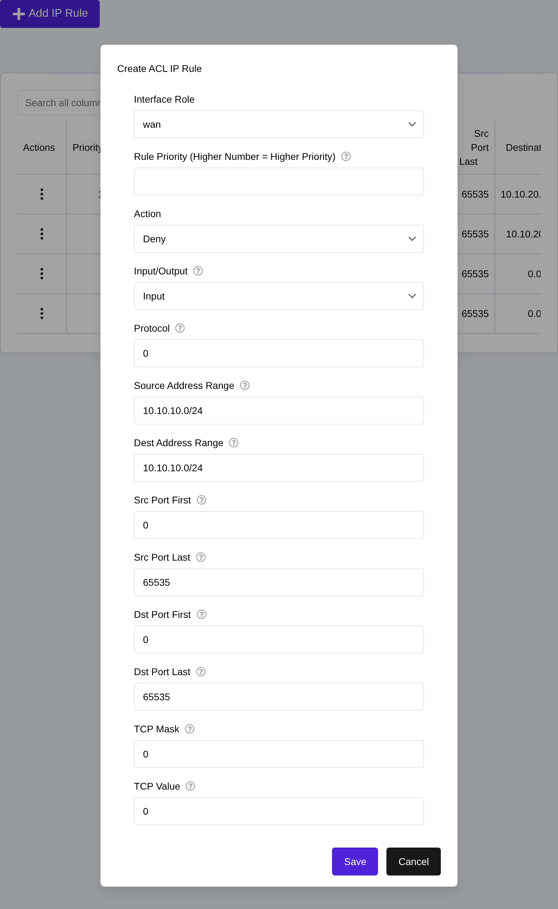
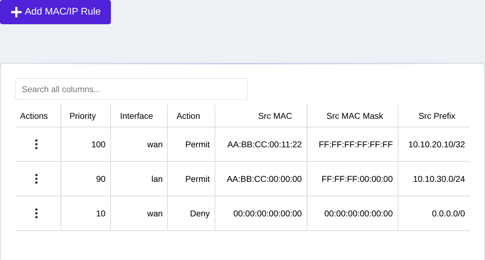
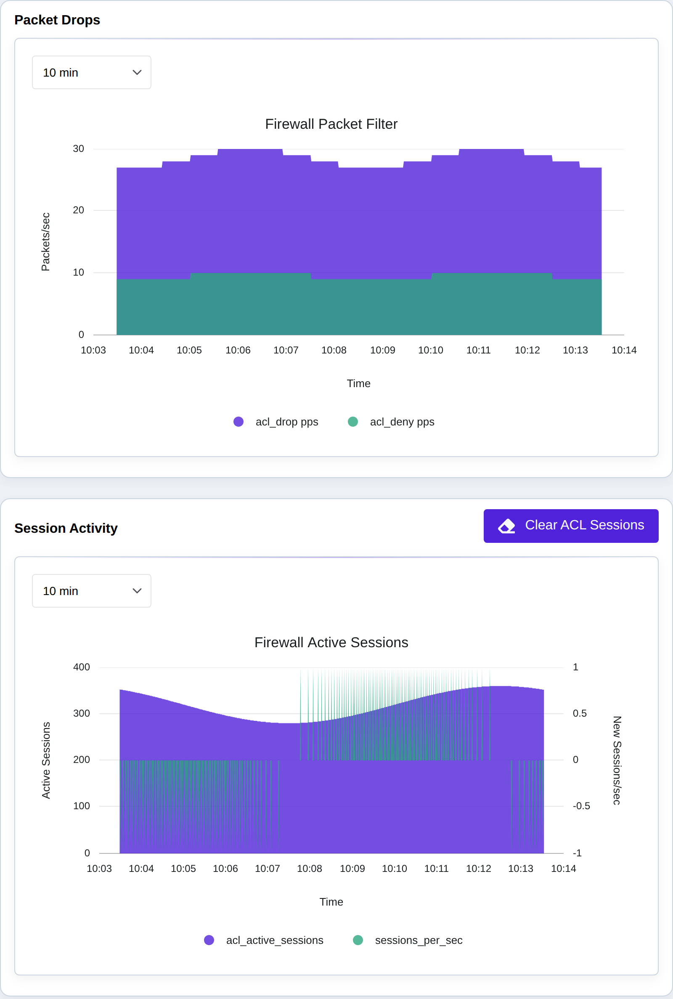

.. _acl_setup:

ACL Setup
=========

eShield-Q Gateway supports Access Control Lists (ACLs) for the Dataplane. 
ACL rules are configured to deny or permit traffic based on various packet fields.
The default ACL is configured to deny all traffic.

There are two types of ACLs:
MACIP ACLs - rules based on MAC or IP address - performance is better than IP ACLs
IP ACLs - rules based on IP address and other Layer3 and Layer4 network fields

ACL rules follow a priority ordering where ACLs with the highest priority are applied first. 
ACL Rules are applied to a specific interface role. LAN or WAN are the currently supported interface roles.

.. note::
    The Management Interface is not affected by the configuration of the ACLs. 
    Management Interface firewalling is performed by the management software for the eShield-Q Gateway.

.. _setup_acl_rules:

Setup ACL Rules
---------------

The eShield-Q Gateway allows ACL rules to be created and managed using the Web UI and REST API.

The Web UI **Firewall -> Rules** page is used to configure ACL rules:

    
|

Adding a new rule is done by selecting the "Add Rule" button on the top of the Web UI:

|

MAC/IP ACL rules (matching on source MAC address in addition to IP) are managed
on the same page under the **MAC/IP Rules** tab:

|

-------
ACL API
-------
The REST API provides two methods to configure ACL rules:
The recommended way is to replace the entire set of rules using the "PUT" method.

* Set the current IP ACL Rules: PUT ``/api/acl/v1/rules/ip``
* Set the current MACIP ACL Rules: PUT ``/api/acl/v1/rules/macip``
* PUT an empty list to delete all current ACL rules

Alternatively the "POST" method can be used to add new rules which are applied based on the ACL priorities.
It is recommended when adding rules to leave gaps in the priority ordering to allow for future rule expansion.

* Add an IP Rule: POST ``/api/acl/v1/rules/ip``
* Add a MACIP Rule: POST ``/api/acl/v1/rules/macip``
* Delete an ACL Rule: DELETE ``/api/acl/v1/rules/ip``
* Delete a MACIP Rule: DELETE ``/api/acl/v1/rules/macip``

.. _view_acl_rules:

View ACL Rules
--------------

The eShield-Q Gateway allows ACL rules to be viewed using the REST API:

* Get the current IP Rules: GET ``/api/acl/v1/rules/ip``
* Get the current IP Rules applied to the WAN or LAN interface: GET ``/api/acl/v1/rules/ip/<interface_role>``
* Get the current MACIP Rules: GET ``/api/acl/v1/rules/macip``
* Get the current MACIP Rules applied to the WAN or LAN interface: GET ``/api/acl/v1/rules/macip/<interface_role>``

.. _view_acl_stats:

View ACL Stats
--------------

The Web UI **Firewall -> Sessions & Drops** page is used to view ACL statistics.
Additional ACL drop/deny counters are available in Monitoring -> System Counters (Errors).

|

.. note::
    The REST API provides statistics on ACL rule violations (deny drops) reported in the ``/api/stats/v2/errors`` statistics see :ref:`statistics`

.. _example_acl_rules:

Example ACL Rules
-----------------
REST API methods are provided in the python eshieldq-gateway-client library ``eshieldq.gateway.client.client_acl``

Example: ACL rule to allow all traffic on both WAN and LAN interfaces - from ``eshieldq.gateway.client.client_acl.set_acl_allow_all()``

.. code-block:: python

    from eshieldq.gateway.schemas.intf import IfaceRoleTypes
    from eshieldq.gateway.schemas.acl import AclAction, IpAclRule, IpProtocol, MacIpAclRule

    def set_acl_allow_all(self) -> bool:
        for is_input in [True, False]:
            for role in [IfaceRoleTypes.LAN, IfaceRoleTypes.WAN]:
                rule = IpAclRule(
                    is_permit=AclAction.ACL_ACTION_API_PERMIT,
                    src_prefix=IPv4Network("0.0.0.0/0"),
                    dst_prefix=IPv4Network("0.0.0.0/0"),
                    proto=IpProtocol.IP_API_PROTO_HOPOPT,
                    src_port_first=0,
                    src_port_last=65535,
                    dst_port_first=0,
                    dst_port_last=65535,
                    tcp_flags_mask=0,
                    tcp_flags_value=0,
                    is_input=is_input,
                    priority=0,
                    interface_role=role,
                )
                resp = self.add_acl_rule(rule=rule)
                if not resp.status_code == HTTPStatus.OK:
                    return False
        return True

Example: A more restricted ACL rule for the WAN interface to allow necessary traffic for IPsec:

.. code-block:: python

    from eshieldq.gateway.schemas.intf import IfaceRoleTypes
    from eshieldq.gateway.schemas.acl import AclAction, IpAclRule, IpProtocol, MacIpAclRule

    def set_acl_wan_allow_ipsec(self):
        for proto in [
            IpProtocol.IP_API_PROTO_UDP,
            IpProtocol.IP_API_PROTO_ESP,
        ]:
            for is_input in [True, False]:
                ike_wan_allow = IpAclRule(
                    is_permit=AclAction.ACL_ACTION_API_PERMIT,
                    src_prefix=IPv4Network("0.0.0.0/0"),
                    dst_prefix=IPv4Network("0.0.0.0/0"),
                    proto=proto,
                    src_port_first=0,
                    src_port_last=(65535), # can be further restricted based on protocol
                    dst_port_first=(0),
                    dst_port_last=(65535),
                    tcp_flags_mask=0,
                    tcp_flags_value=0,
                    priority=100,  # ensure this is higher priority than other deny rules
                    is_input=is_input,
                    interface_role=IfaceRoleTypes.WAN,
                )
                self.add_acl_rule(rule=ike_wan_allow)

Next Steps
-----------
Once the eShield-Q Gateway is configured to allow the desired traffic on both LAN and WAN interfaces, 
IPsec connections may be configured see :ref:`ipsec_setup`