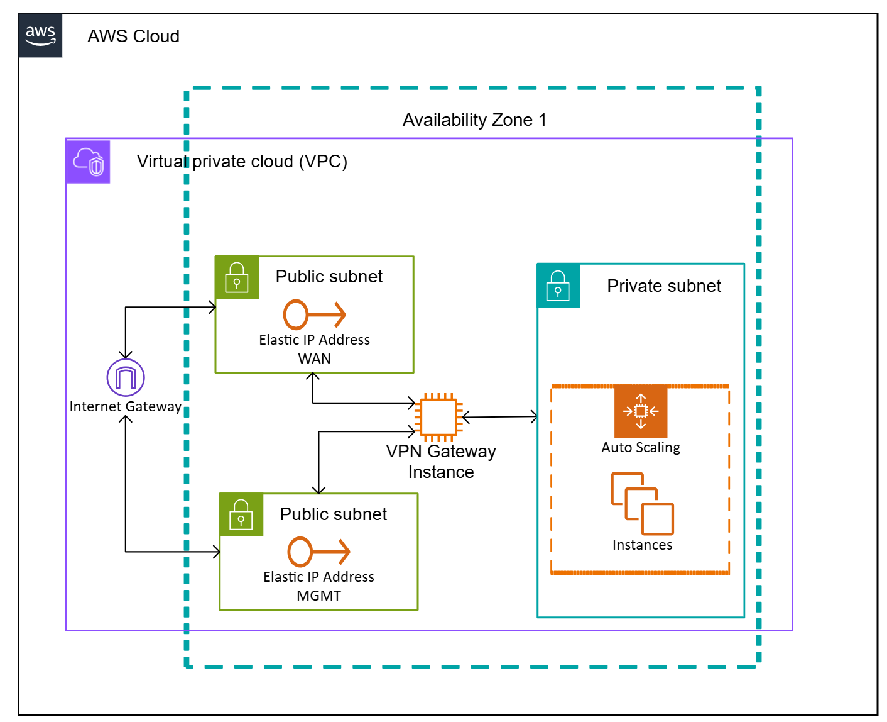

.. _aws_overview:

--------------------------
eShield-Q Gateway in AWS
--------------------------

The eShield-Q Gateway is available for the `AWS Marketplace <https://aws.amazon.com/marketplace>`_.

This section describes how the eShield-Q Gateway integrates into an AWS network.
The eShield-Q Gateway can be used to protect a Virtual Private Cloud (VPC) hosted in AWS.
The eShield-Q Gateway can aggregate multiple private networks in AWS and 
connect to remote cloud or on-premises network(s).

eShield-Q Gateway requires the following AWS resources: 

* 1 VPC for the eShield-Q Gateway
* 2 Public Interfaces, Public Subnets, and Elastic IPs (MGMT and WAN)
* 1 Private Interface, Private Subnet (LAN)
* 1 Internet Gateway (for the VPC)
* Security Groups and Routing tables to forward traffic to the eShield-Q Gateway

The LAN and WAN interfaces must be configured using the Elastic Network Adaptor (ENA) interfaces
and they support high speed traffic.

The MGMT and WAN interfaces require Elastic (Public IP) addresses as they are accessible on the internet. 

The MGMT interface should be configured with a Security Group to allow only SSH and HTTPS traffic to the MGMT Interface.

The LAN interface use Network Routes to direct traffic destined for remote private networks through the eShield-Q Gateway.

An Internet Gateway should be used to allow MGMT and WAN traffic to the internet.

The minimum virtual machine requirements for the eShield-Q Gateway is an X86-64 based platform with at least 8 vCPUs (e.g., c6in.2xlarge).
To achieve best performance a compute optimized (C instance) with high Network Bandwidth should be used. 

.. _install_aws:

AWS Cloud Installation
-------------------------
It is recommended to use the eShield-Q Gateway Terraform Module (|TBD-LINK|).

The `AWS CLI <https://aws.amazon.com/cli/>`_ utility can also be used to setup the necessary resources for the eShield-Q Gateway. 

  