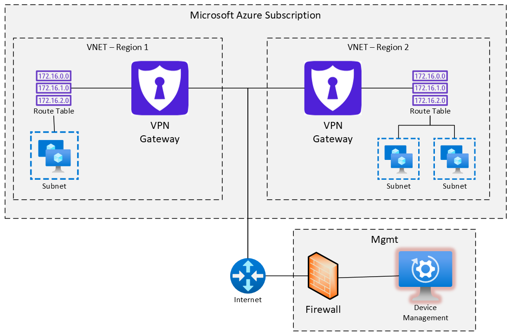
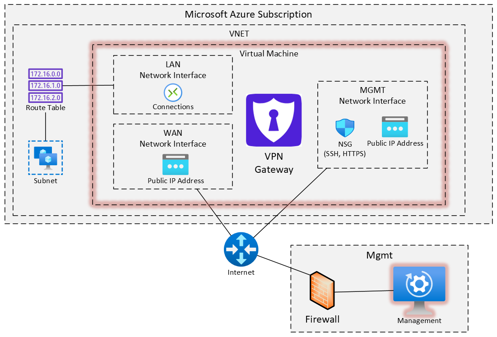

.. _azure_overview:

--------------------------
eShield-Q Gateway in Azure
--------------------------
The eShield-Q Gateway is available for the `Microsoft Azure Cloud <https://azuremarketplace.microsoft.com/>`_.

.. note::

   The Azure Marketplace offer link and every component of the image URN below
   -- publisher, offer and plan/SKU -- are **TBD**. Ask your Quantum eMotion
   contact for the current values.

The eShield-Q Gateway integrates into a Microsoft Azure network as shown below. 
In this example, the eShield-Q Gateway is used to protect Virtual Networks (VNETs) in different geographic regions
and to connect resources hosted in a different Cloud Service Provider (CSP). 
Further, the eShield-Q Gateway connects networks that are protected using an On-Premises Firewalls. 
The eShield-Q Gateway(s) can be managed from anywhere with an internet connection, below shows management using On-Premises resources.

.. _azure_vm_overview:

Azure Virtual Machine Overview
------------------------------

The eShield-Q Gateway uses Microsoft Azure secure provisioning and Azure network resources allowing for fast and secure deployment. 
The eShield-Q Gateway requires three Network Interfaces:

* Local Area Network (LAN) used to connect to the private Virtual Network Subnet(s),
* Wide Area Network (WAN) used to connect to remote peer networks (internet connection), 
* Management (MGMT) interface used to manage the eShield-Q Gateway over SSH and HTTPS

The LAN and WAN interfaces require Accelerated Networking for high-bandwidth applications. 
The MGMT and WAN interfaces are allocated a Public IP address as they are accessible on the internet. 
The MGMT interface is further protected using a Network Security Group (NSG) that allows only SSH and HTTPS traffic to the MGMT Interface. 
The LAN interface use Azure Network Route Table to direct traffic destined for remote private networks through the eShield-Q Gateway

.. _install_azure:

Microsoft Azure Cloud Installation
----------------------------------
The Azure Command Line utility 'az' can be used to setup the necessary resources for the eShield-Q Gateway. 

Create the Resource Group and Subnets for the eShield-Q Gateway:

.. code-block:: bash
    
    # update these to match your Azure Account settings
    REGION="westus2"
    RESOURCE_GROUP="my-resources"
    STORAGE_AREA="my-storage-area"

    VNET_NAME="vnet-1"
    VNET_ADDR_PREFIX="10.0.0.0/16"
    
    WAN_SUBNET_NAME="wan-subnet"
    WAN_SUBNET="10.0.0.0/24"

    LAN_SUBNET_NAME="lan-subnet"
    LAN_SUBNET="10.0.1.0/24"

    MGMT_SUBNET_NAME="mgmt-subnet"
    MGMT_SUBNET="10.0.2.0/24"    

    # Create a new Resource Group
    az group create -n ${RESOURCE_GROUP}

    # Create a new VNET 
    az network vnet create \
            -n ${VNET_NAME} \
            -g ${RESOURCE_GROUP} \
            --address-prefixes ${VNET_ADDR_PREFIX}
    
    # Create the WAN Subnet
    az network vnet subnet create \
        -g ${RESOURCE_GROUP} \
        --vnet-name ${VNET_NAME} \
        -n ${WAN_SUBNET_NAME} \
        --address-prefixes ${WAN_SUBNET}
    
    # Create the LAN Subnet
    az network vnet subnet create \
        -g ${RESOURCE_GROUP} \
        --vnet-name ${VNET_NAME} \
        -n ${LAN_SUBNET_NAME} \
        --address-prefixes ${LAN_SUBNET}

    # Create the MGMT Subnet
    az network vnet subnet create \
        -g ${RESOURCE_GROUP} \
        --vnet-name ${VNET_NAME} \
        -n ${MGMT_SUBNET_NAME} \
        --address-prefixes ${MGMT_SUBNET}

    # Create Public IP addresses for the WAN and MGMT subnets
    PUBLIC_WAN_IP_NAME="WAN-PUB-IP-1"
    PUBLIC_MGMT_IP_NAME="MGMT-PUB-IP-1"
    az network public-ip create \
        -g ${RESOURCE_GROUP} \
        -n ${PUBLIC_WAN_IP_NAME} \
        --allocation-method Static

    az network public-ip create \
        -g ${RESOURCE_GROUP} \
        -n ${PUBLIC_MGMT_IP_NAME} \
        --allocation-method Static

Create the Network Security Group for the MGMT Network:

.. code-block:: bash

    # create the network Security Group for the MGMT subnet
    MGMT_NSG_NAME="MGMT-NSG-1"
    az network nsg create \
    -n ${MGMT_NSG_NAME} \
    -g ${RESOURCE_GROUP}

    # Open SSH (port 22) and HTTPS (port 443) to MGMT port
    az network nsg rule create \
        --name MGMT_Allow_SSH_HTTPS \
        --nsg-name ${MGMT_NSG_NAME} \
        -g "${RESOURCE_GROUP}" \
        --priority 100 \
        --access Allow \
        --destination-port-ranges 22 443 \
        --direction Inbound \
        --protocol Tcp

Create the MGMT, WAN and LAN Network Interfaces:

.. code-block:: bash

    MGMT_NIC_N="MGMT-nic"
    WAN_NIC_N="WAN-nic"
    LAN_NIC_N="LAN-nic"
    # create MGMT Network Interface
    az network nic create \
        -g ${RESOURCE_GROUP} \
        --vnet-name ${VNET_NAME} \
        --subnet ${MGMT_SUBNET_NAME} \
        -n ${MGMT_NIC_N} \
        --public-ip-address ${PUBLIC_MGMT_IP_NAME} \
        --network-security-group ${MGMT_NSG_NAME}

    # Create WAN Network Interface (note Accelerated Network is required)
    echo "Creating NIC $WAN_NIC_N"
    az network nic create \
        -g ${RESOURCE_GROUP} \
        --vnet-name ${VNET_NAME} \
        --subnet ${WAN_SUBNET_NAME} \
        -n ${WAN_NIC_N} \
        --public-ip-address ${PUBLIC_WAN_IP_NAME} \
        --ip-forward \
        --accelerated-networking

    # create LAN Network Interface (note Accelerated Network is required)
    az network nic create \
        -g ${RESOURCE_GROUP} \
        --vnet-name ${VNET_NAME} \
        --subnet ${LAN_SUBNET_NAME} \
        -n ${LAN_NIC_N} \
        --ip-forward \
        --accelerated-networking

Create the eShield-Q Gateway Virtual Machine:

.. code-block:: bash

    # The Marketplace publisher, offer and plan/SKU are TBD; take all three
    # from your Marketplace listing. The URN is publisher:offer:sku:version.
    PUBLISHER="<TBD-publisher>"

    # view all available eShield-Q Gateway versions:
    # az vm image list --publisher ${PUBLISHER} --all
    # then update below with the latest eShield-Q Gateway version
    GW_URN="${PUBLISHER}:<TBD-offer>:<TBD-sku>:<version>"
    ADMIN_USER="ssh_admin"

    # Disk Size must be >= 2 GB 
    DISK_SIZE="4"

    # Size must support: 3 NICs, Accelerated Network and 8GB of RAM
    VM_SIZE="Standard_F8s_v2"

    # create the eShield-Q Gateway VM
    az vm create \
        --resource-group ${RESOURCE_GROUP} \
        --security-type Standard \
        --image ${GW_URN} \
        --name eshieldq-gateway-gw1 \
        --os-disk-size-gb ${DISK_SIZE} \
        --size ${VM_SIZE} \
        --nics ${MGMT_NIC_N} ${WAN_NIC_N} ${LAN_NIC_N} \
        --enable-agent true \
        --boot-diagnostics ${STORAGE_AREA} \
        --admin-username ${ADMIN_USER} \
        --generate-ssh-keys 

.. note::
    The first supplied Network Interface must always be the MGMT interface. Following the MGMT 
    Network Interface the WAN and LAN interface ordering does not matter. Instead the eShield-Q Gateway uses 
    the assigned private IP address to set the WAN and LAN interface roles on the system.
    These roles may be changed as needed via the REST API but the below IP address scheme is expected
    for proper WAN and LAN role assignment: 
    
    The WAN Network Private IP address should be of the form: 10.X.0.X 
    The LAN Network Private IP address should be of the form: 10.X.1.X

    see :ref:`interface_role_assignment`

Initial Login 
------------------------------------------

Once the VM has been created, login using SSH to the VM:

.. code-block:: bash

    # export the SSH from Azure if the VM has been created with a key pair
    PRIV_KEY_FILE="<path_to_SSH_private_key>"

    echo "MGMT Public IP:"
    MGMT_PUB_IP=$(az network public-ip show \
        -n ${PUBLIC_MGMT_IP_NAME} \
        -g ${RESOURCE_GROUP} \
        --query "{ipAddress:ipAddress}" \
        --output tsv)

    ssh -i ${PRIV_KEY_FILE} ${ADMIN_USER}@${MGMT_PUB_IP}

.. note::
    SSH and HTTPS are enabled by default for the VM.
    See :ref:`initial_user` for details on how to add an initial user.