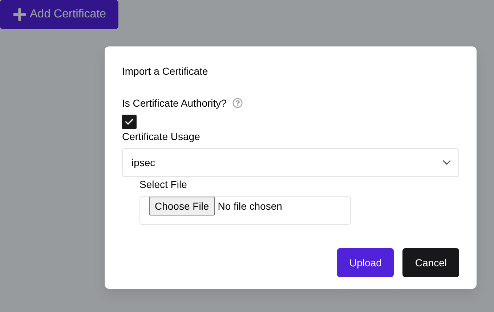
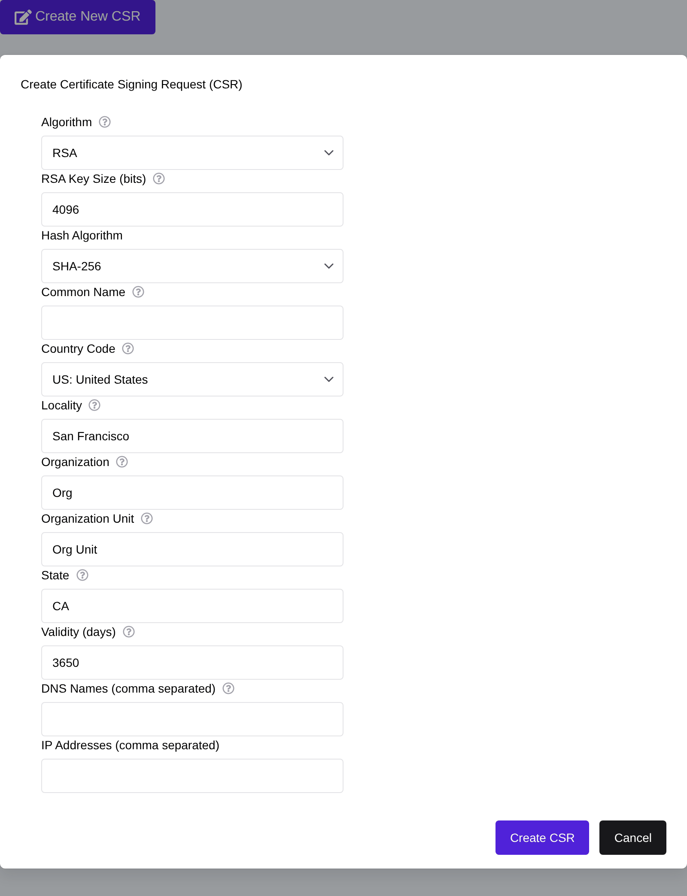
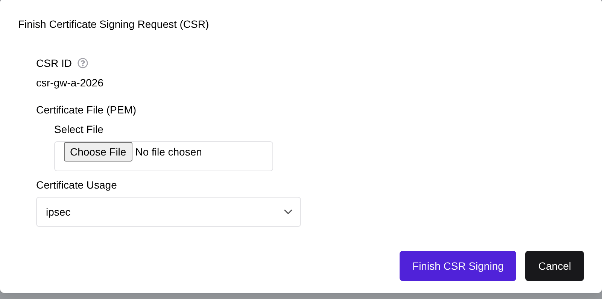
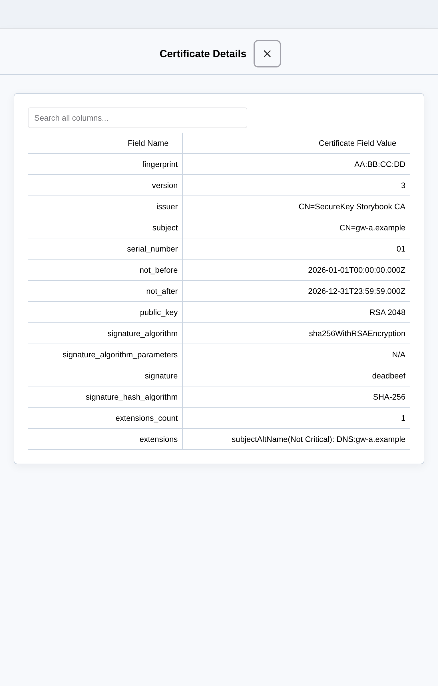
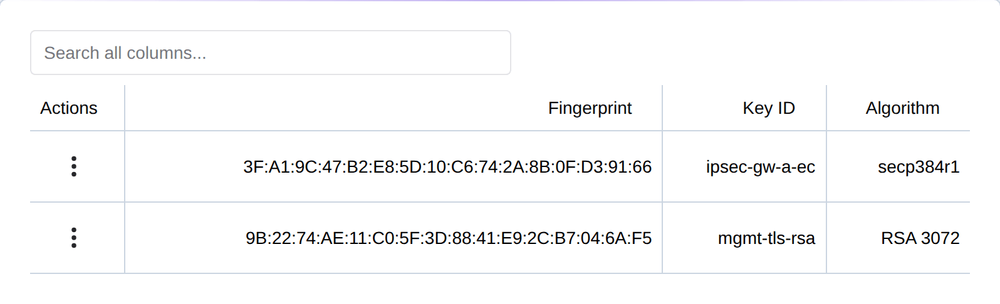
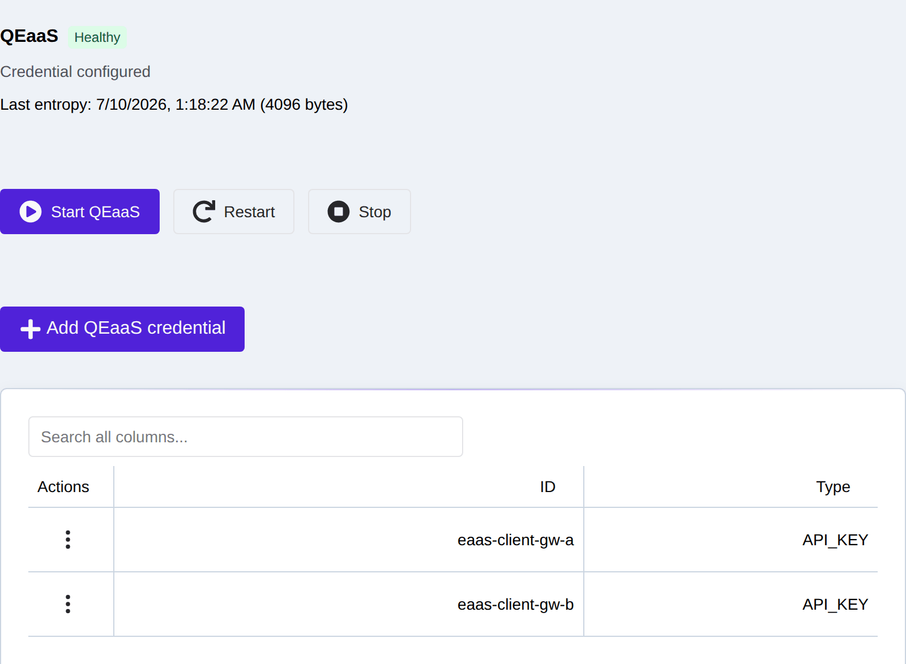

Certificates
============

.. _certificates:

Certificate Support
-------------------
The eShield-Q Gateway supports Certificate Based Authentication.

The eShield-Q Gateway enforces key-strength compliance for internally
generated and user uploaded certificates:

* RSA keys: 3072-bit or larger
* EC keys: P-384 or P-521

Certificate signature hashes of SHA-384+ are recommended
(`CNSA v1.0 <https://media.defense.gov/2021/Sep/27/2002862527/-1/-1/0/CNSS%20WORKSHEET.PDF>`_);
SHA-256 signatures are accepted unless the optional CNSA-only enforcement
mode is enabled, which requires CNSA v1.0 algorithms throughout.

.. _cert_import:

Certificate Import
------------------

The eShield-Q Gateway allows admins to import Certificates which can be used for 
authentication. The eShield-Q Gateway supports PEM formatted X509 Certificates.

--------------------------
Import using Web Interface
--------------------------
Import CAs and User Certificates using the PKI & Secrets -> Certificates:

|

---------------------
Import using REST API
---------------------
The REST API can be used to import Certificates:

* POST ``/api/certs/v1/user``
* POST ``/api/certs/v1/tls/client-cert``
* POST ``/api/certs/v1/syslog/ca``

.. _cert_csr:

Certificate Signing Request (CSR)
---------------------------------

The eShield-Q Gateway supports Certificate Signing Requests (CSR) which can be used to generate 
private keys local to the eShield-Q Gateway and export a CSR. The CSR can then be signed by a Certificate Authority (CA)
to generate a signed Certificate. This signed Certificate can be uploaded to the eShield-Q Gateway and used 
to authenticate the eShield-Q Gateway.

This process is used in multiple scenarios including generating IPsec identity certificates,
Syslog client certificates, and HTTPS certificates for Web authentication. 

-----------------------
CSR using Web Interface
-----------------------
The eShield-Q Gateway Web Interface **PKI & Secrets -> Keys & CSRs** page (Signing Requests section) can be used to create CSRs and upload signed certificates:

|

The CSR PEM formatted data is displayed in the Signing Request Table and can be downloaded then signed by a Certificate Authority.
To Upload the signed certificate to the eShield-Q Gateway, find the CSR in the Signing Request Table and 
click on the Actions Menu -> Upload Signed Certificate.
Select the signed certificate file and select the `usage` field for how this certificate will be used.

|

------------------
CSR using REST API
------------------
In order to generate a CSR, use the REST API:

* (*Pre*) Generate a Certificate Authority (CA) Root Certificate and Private Key pair which will be used to sign the Certificate.
* Export a Certificate Signing Request: POST ``/api/certs/v1/signing_request``.
  The eShield-Q Gateway generates a Private Key and exports the CSR for the user to sign with the CA.
* Sign the CSR with the CA Root Private Key.
* Upload the signed certificate to the eShield-Q Gateway via the POST ``/api/certs/v1/signed_csr`` endpoint, setting the ``usage`` field to how the
  certificate will be used (e.g. ``IPSEC``, ``HTTPS_SERVER``, or ``SYSLOG_CLIENT``).
* Verify the certificate details using the GET ``/api/certs/v1/all`` and ``/api/certs/v1/details`` endpoints.

.. _cert_details:

Certificate Information and Details
-----------------------------------
The eShield-Q Gateway provides information and details of all certificates on the system.
Certificate Information enpoints give a summary of the certificate and contains a Unique Identifier called the `fingerprint`
which is used in other Certificate Operations.
Certificate Details endpoints give the full description of the certificate and contains all fields in the certificate.

-------------------------------------
Web Interface Certificate Information
-------------------------------------
The eShield-Q Gateway Web Interface can be used to view details of and manage certificates on the Certificates Page:

.. image:: images/UI/Certificates.png
    :align: center

|

To view the details of a certificate, click on the Actions Menu -> View Details which opens a slideout containing the full details of the certificate.

|

--------------------------------
REST API Certificate Information
--------------------------------
The REST API can be used to get the summary information of certificates:

* GET ``/api/certs/v1/all``
* GET ``/api/certs/v1/ca``
* GET ``/api/certs/v1/user``

The REST API can be used to check the details of all certificates:

* GET ``/api/certs/v1/all``
* GET ``/api/certs/v1/details``
* GET ``/api/certs/v1/tls/server-cert``
* GET ``/api/certs/v1/syslog/ca``
* GET ``/api/certs/v1/syslog/client-cert``

.. _private_keys:

Private Keys
------------
The eShield-Q Gateway generates and stores private keys locally (for example the
key generated with each CSR). The **PKI & Secrets -> Keys & CSRs** page (Keys section) lists the private
keys held on the device by algorithm and fingerprint. Private key material never
leaves the device and is never exported through the API — only key metadata is
listed.

|

Using the REST API:

* List private keys: GET ``/api/certs/v1/private_keys``

.. _entropy_service:

Entropy Service (EaaS)
----------------------
The eShield-Q Gateway can provide **Entropy as a Service (EaaS)** — supplying
high-quality quantum-grade random data to authorised clients. The
**System -> Services** page (Entropy Service section) shows the service status and the client
secrets (API keys) authorised to request entropy.

|

Using the REST API:

* Get the entropy-service status: GET ``/api/eaas/v1/eaas_status``
* List EaaS client secrets: GET ``/api/eaas/v1/eaas_secrets``
* Start / stop the service: POST ``/api/eaas/v1/eaas_control``

.. note::
   EaaS client secrets are write-only: they are never returned by the API, only
   set and deleted.

.. _cert_revocation_lists:

Certificate Revocation Lists
----------------------------

The eShield-Q Gateway does not support Certificate Revocation List (CRL) used to revoke certificates.
This feature will be added in a future update.

Currently the eShield-Q Gateway allows management of Certificates via the REST API, including deletion of Certificates.
IPsec Connections may be configured for re-authentication which does not require CRLs, but does enforce Certificate Date validation.

.. _cert_examples:

Example Certificate Operations
------------------------------

This section contains example OpenSSL commands that can be used to generate and sign certificates.

.. _ca_generation:

---------------------------------
Example CA Certificate Generation
---------------------------------

The below OpenSSL commands can be used to generate a self-signed (Root) Certificate Authority
which can be used to sign a Certificate Signing Request (CSR) for use by the eShield-Q Gateway.

.. code-block:: bash

    openssl req -x509 -newkey rsa:4096 -sha384 -days 3650 -keyout root_key.pem -out root_cert.pem -config openssl_root.conf

OpenSSL Configuration file (openssl_root.conf)

.. code-block:: bash
    
    ####################################################################
    [ ca ]
    default_ca    = CA_default      # The default ca section

    [ CA_default ]
    dir              = .
    certs            = $dir
    crl_dir          = $dir
    new_certs_dir    = $dir
    database         = $dir/syslog-root-ca-index.txt
    serial           = $dir/syslog-root-ca.srl

    default_days     = 3650         # How long to certify for
    default_crl_days = 30           # How long before next CRL
    default_md       = sha384       # Use public key default MD
    preserve         = no           # Keep passed DN ordering

    x509_extensions  = v3_ca        # The extensions to add to the cert

    email_in_dn     = no            # Don't concat the email in the DN
    copy_extensions = copy          # Required to copy SANs from CSR to cert

    policy            = signing_policy

    ####################################################################
    [ req ]
    default_bits       = 4096
    distinguished_name = ca_distinguished_name
    x509_extensions    = v3_ca
    string_mask        = utf8only

    ####################################################################
    [ ca_distinguished_name ]
    countryName         = Country Name (2 letter code)
    countryName_default = US

    stateOrProvinceName         = State or Province Name (full name)
    stateOrProvinceName_default = California

    organizationName            = Organization Name (eg, company)
    organizationName_default    = Quantum eMotion

    commonName         = Common Name (e.g. server FQDN or YOUR name)
    commonName_default = TEST Root CA 1

    emailAddress         = Email Address
    emailAddress_default = info@quantumemotion.com

    ####################################################################
    [ v3_ca ]

    subjectKeyIdentifier   = hash
    authorityKeyIdentifier = keyid:always, issuer
    basicConstraints       = critical, CA:true
    keyUsage               = keyCertSign, cRLSign

    ####################################################################
    [ v3_intermediate_ca ]

    subjectKeyIdentifier   = hash
    authorityKeyIdentifier = keyid:always, issuer
    basicConstraints = critical, CA:true, pathlen:0
    keyUsage = critical, digitalSignature, keyCertSign, cRLSign
    extendedKeyUsage = serverAuth

    ####################################################################
    [ signing_policy ]
    countryName            = optional
    stateOrProvinceName    = optional
    localityName           = optional
    organizationName       = optional
    organizationalUnitName = optional
    commonName             = supplied
    emailAddress           = optional

    ####################################################################
    [ signing_req ]
    subjectKeyIdentifier   = hash
    authorityKeyIdentifier = keyid,issuer
    basicConstraints       = CA:FALSE
    keyUsage               = digitalSignature, keyEncipherment

.. _cert_generation:

------------------------------
Example Certificate Generation
------------------------------

The below OpenSSL (v3.0+) commands can be used to generate a Certificate Signing Request (CSR).

.. code-block:: bash

    # below adds subjectAltName to the CSR
    openssl req -new -nodes -sha384 \
    -subj "/CN=Test Certificate/O=Organization/ST=CA/C=US" \
    -extensions v3_req \
    -reqexts SAN \
    -key test_key.pem \
    -out test.csr \
    -config <(cat /etc/ssl/openssl.cnf <(printf "[SAN]\nsubjectAltName=DNS:10.10.10.1"))

.. _cert_signing:

---------------------------
Example Certificate Signing
---------------------------

A PEM formatted CSR file is exported from eShield-Q Gateway in most cases.
The below OpenSSL (v3.0+) commands can be used to sign the CSR using the CA Certificate and Private Key.

.. code-block:: bash

    # Sign the CSR using the CA certificate and Private Key
    openssl x509 -req -days 3650 -in test.csr \
    -CA root_cert.pem -CAkey root_key.pem \
    -CAcreateserial \
    -out test_cert.pem \
    -extfile <(cat /etc/ssl/openssl.cnf <(printf "[SAN]\nsubjectAltName=DNS:10.10.10.1")) \
    -extensions SAN