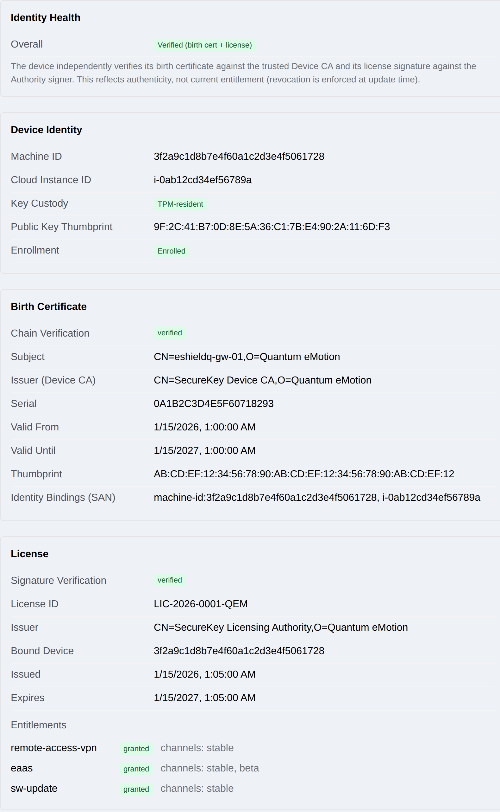

.. _device_license:

Device Identity and Licensing
=============================

Each eShield-Q Gateway has a cryptographic **device identity** and, once
enrolled, a signed **license** that grants the features the device is entitled
to use. The Web UI **System -> License** page shows the current identity,
enrollment, and license state; the same information is available through the
REST API.

.. _device_identity:

Device Identity
---------------

The device identity is a per-instance key pair whose private key is protected by
the platform. The identity view reports:

* **Machine ID / Instance ID** — the cloud instance identifiers that bind the
  identity to this specific VM.
* **Key custody** — where the identity private key is held. The key is generated
  on the appliance and stored on its encrypted ``/var`` volume, which never
  leaves the instance.
* **Public key thumbprint** — the fingerprint of the device public key. It is
  reported as soon as the key exists, before enrollment as well as after, because
  it is the value support asks for when a device has to be re-registered.
* **Birth certificate** — the certificate issued to the device at enrollment
  (subject, issuer, validity window, and validity state).

|

.. _device_enrollment:

Enrollment
----------

Enrollment binds the device identity to the licensing Authority and provisions
the device birth certificate. It uses the cloud platform's **attested identity
document** so the Authority can verify the device is a genuine eShield-Q Gateway
instance before issuing credentials — no operator secret is entered on the
device.

Enrollment is normally performed automatically at first boot, and is retried in
the background if the Authority cannot be reached. An operator only needs to
intervene when it has not completed.

**Enrol device** appears on the **System -> License** page while the device is
not yet enrolled. It starts the same attestation the device performs at boot.
Enrollment runs in the background; the page updates when it finishes. The button
is unavailable if the device has no identity key, because there is then nothing
to attest with.

The equivalent REST calls are:

* Trigger enrollment: POST ``/api/identity/v1/enroll``
* Get identity, enrollment, and license status: GET ``/api/identity/v1/status``

.. note::
   Enrollment issues credentials but does not choose them. Which features the
   device is entitled to is decided by the licensing Authority from your
   subscription, not by anything set on the appliance.

.. _device_reenrollment:

Re-enrolling a Device
---------------------

A license is issued **once**, at enrollment, and is not re-evaluated afterwards.
A change to your subscription therefore does not reach a device that is already
enrolled until the device enrolls again. Re-enrollment is how an existing
appliance picks up a new entitlement — for example a feature added to your
subscription after the appliance was deployed.

**Re-enrol device** appears on the **System -> License** page for
**administrators only**, and asks for confirmation before it runs. It replaces
the device's birth certificate and license with freshly issued ones. The
identity key is not changed, and the device does not lose its enrollment: if the
Authority refuses, the existing certificate and license are left exactly as they
were.

Over the REST API, re-enrollment is the same endpoint with ``force`` set::

   POST /api/identity/v1/enroll
   {"force": true}

Because enrollment is asynchronous, ``healthy`` cannot tell you whether a forced
run succeeded — it is true before, during, and after a failed attempt on a
device that was already enrolled. Poll the outcome instead::

   GET /api/identity/v1/enroll/result

which reports ``running``, ``done``, or ``failed`` together with the Authority's
own reason for a refusal. The UI shows the same outcome on the page.

Every re-enrollment request is recorded in the device audit log
(see :ref:`audit_log`) with the administrator who requested it, whether or not
it succeeds.

.. _device_key_changed:

If the Device Key Changes
-------------------------

Each instance is registered to **one** device key, and the first enrollment
wins. That is what stops a copied cloud credential from registering a second key
against your appliance, and it is deliberate.

The consequence is that if the appliance's identity key is lost or replaced —
after a ``/var`` recovery, a restored or re-imaged instance, or a cloud
operation that resets the platform's security processor — the Authority will
**refuse** to enroll the new key. The device holds a working key that no
certificate is bound to, and the page shows a persistent notice reading *This
instance is registered to a different device key*.

The appliance cannot resolve this by itself; if it could, so could anyone
holding a copy of its cloud credentials. Recovery is a deliberate,
audited action performed by Quantum eMotion support:

1. Note the **public key thumbprint** shown on the **System -> License** page.
   This is the device's *current* key — the one the registry must be re-pointed
   to — and it is displayed even though the device is not enrolled.
2. Contact support with that thumbprint and the instance ID.
3. Support re-registers the instance to the named key. The registration is
   bound to that thumbprint specifically, so no other key can take the slot in
   the meantime, and the previous key's licenses are revoked.
4. Select **Enrol device** (or ``POST /api/identity/v1/enroll``). The device
   enrolls with its new key and receives a fresh certificate and license.

A software update cannot repair this state, because a licensed update needs the
license the device has just lost.

.. _device_license_status:

License Status
--------------

Once enrolled, the device holds a signed license listing its **entitlements** —
the features the device may use (for example ``remote-access-vpn``, ``eaas``,
and ``sw-update``). The license view reports:

* **License present / valid** — whether a signed, in-date license is installed.
* **Issuer and device binding** — the Authority that issued the license and the
  device/instance it is bound to.
* **Validity window** — issued-at and expiry timestamps.
* **Entitlements** — each licensed feature and whether it is granted.

A device whose license is missing, expired, or fails signature validation
reports an unhealthy state; affected features are disabled until a valid license
is obtained (see :ref:`device_reenrollment`). Enrollment and license events are
recorded in the device audit log (see :ref:`audit_log`).

.. _device_key_health:

Device Key Health and Update Readiness
--------------------------------------

The device periodically re-measures its identity key — it signs a self-test and
checks that its birth certificate is still bound to the key it would present.
The status view reports this measurement separately from the license:

* **Healthy** — the certificate and license verify against the device's trust
  anchors *and* a current key measurement says the key can still sign. This is
  the field to alarm on.
* **Update ready** — whether the device should be offered a software update.
* **Key status age** — how long ago the key was last measured. Empty means it
  has never been measured on this boot.

**Healthy and Update ready can legitimately disagree.** If the measurement stops
being refreshed, the device reports *not healthy* — a refresh that stopped is a
real fault worth investigating — but it stays *update ready*, because the update
itself proves the key with a live signature at download time. A device is only
reported not update ready when something is known to be wrong: it is not
enrolled, its certificate or license does not verify, or a completed measurement
showed the key cannot sign.

.. note::

   Update readiness is the device's own pre-check, not an authorization. Device
   binding, entitlement, and revocation are enforced by the update service when
   the device asks for a bundle.

Troubleshooting
~~~~~~~~~~~~~~~

**Healthy is false and the key status age is large or empty, but the device
otherwise works.** The periodic key measurement is not running. The device is
still updatable, so this is not urgent, but the key is no longer being watched.
Collect a support bundle and check the audit log for ``device_key`` events.

**Update ready is false.** Check, in order: is the device enrolled; do the birth
certificate and license both report valid; does the key status report a signing
failure. A signing failure with a non-zero TPM lockout counter means the TPM is
rate-limiting authentication attempts — see :ref:`audit_log` for the
``device_key`` events that record it.

**A licensed feature you have subscribed to is not granted.** Entitlements are
fixed at enrollment, so a subscription change does not reach an enrolled device
on its own. Re-enrol the device (see :ref:`device_reenrollment`) and check the
entitlement list again.

**"This instance is registered to a different device key."** The identity key is
not the one the Authority holds for this instance. This is expected after a
``/var`` recovery or a restored instance, and it needs a support-side
re-registration — see :ref:`device_key_changed`.

**Re-enrolment reports failed.** Read ``GET /api/identity/v1/enroll/result``, or
the notice on the License page, for the Authority's own reason. The existing
certificate and license are unchanged by a failed attempt, so the device keeps
working on its previous license.

Next Steps
----------
Software updates see :ref:`updates`. Security and audit logging see
:ref:`security_configuration`.
