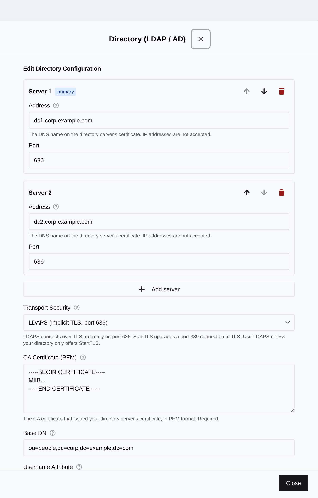
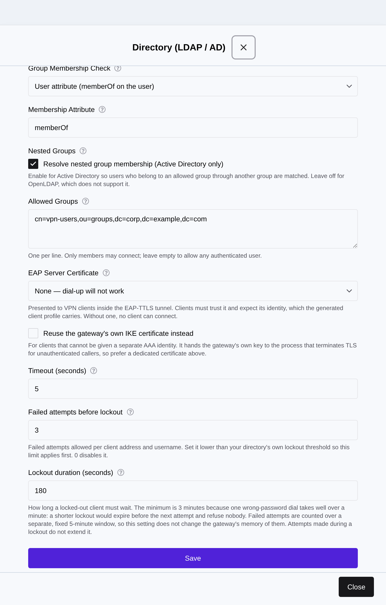
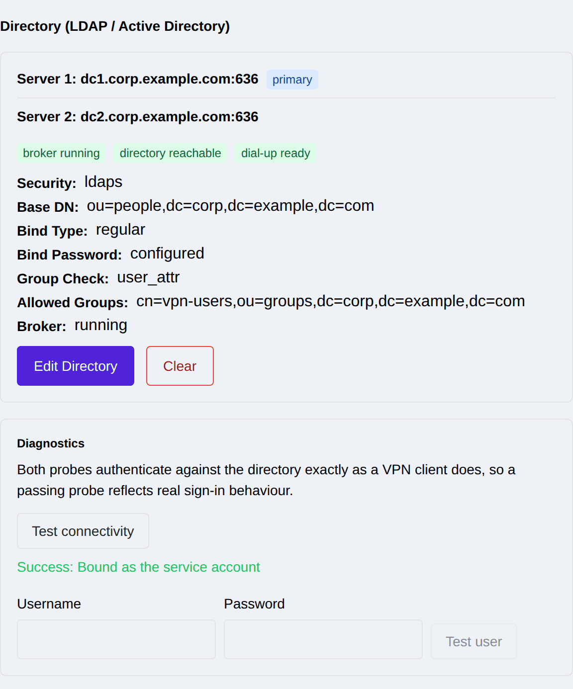
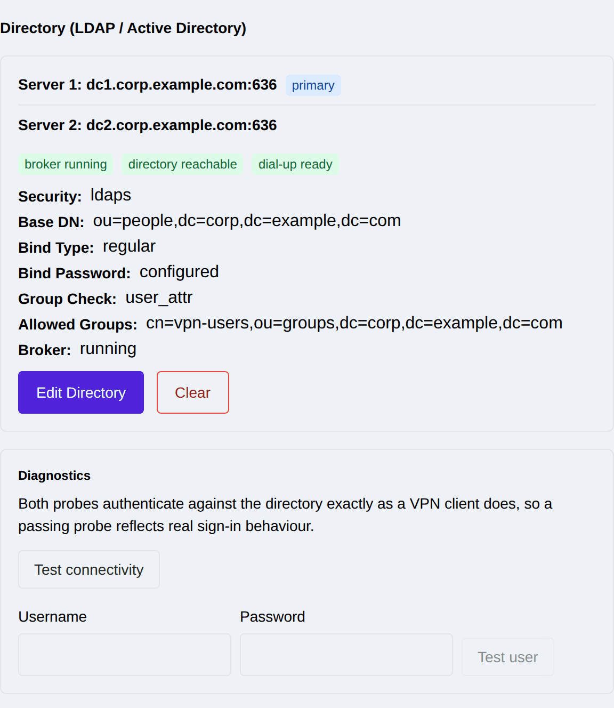

.. _directory_auth:

Directory Authentication (LDAP / Active Directory)
==================================================

Remote-access (dial-up) users can be authenticated against your existing
**LDAP or Active Directory** server, so VPN accounts are the accounts you
already manage: disabling a user in the directory disables their VPN access, and
group membership decides who is allowed to connect.

This is an alternative to the other remote-access authentication back ends
(see :ref:`remote_access_auth_methods`). It removes the need to run a separate
RADIUS server just to reach a directory, and it removes the need to maintain a
second copy of your user list on the gateway.

.. note::
   Directory authentication and an external RADIUS server are **mutually
   exclusive**. The gateway has a single EAP authentication back end, so
   configuring one takes over from the other. If a RADIUS configuration is
   present, the directory settings are stored but not put into service, and the
   Web UI says so explicitly. Remove the RADIUS configuration first
   (:ref:`remote_access_radius`).

.. _directory_auth_how_it_works:

How it works
------------

The gateway runs an on-appliance **authentication broker**. When a client dials
in, the gateway passes the user's credentials to that broker, and the broker
binds to your directory **as that user** over a TLS-protected connection. If the
bind succeeds and the user is in one of the allowed groups, the client is
admitted.

Two consequences are worth knowing before you plan a deployment:

* **The gateway never needs your users' password hashes.** It proves each
  password by binding with it, exactly as any other LDAP application would, so
  no directory schema change and no password export is involved.
* **The service account only needs to search.** It locates the user's entry and
  reads group membership. It never needs to modify anything, and it should be
  created with read-only rights.

.. _directory_auth_requirements:

What you need before you start
------------------------------

.. list-table::
   :widths: 28 72
   :header-rows: 1

   * - Item
     - Notes
   * - Directory server **DNS name**
     - A name, not an IP address. The gateway verifies the server's certificate
       against this name and refuses a bare IP, because a certificate cannot
       vouch for one.
   * - **CA certificate** (PEM)
     - The authority that issued your directory server's certificate. Always
       required — there is no plaintext option and certificate validation cannot
       be turned off.
   * - **Service account** DN and password
     - A read-only account used to find user entries. Not needed if your
       directory permits anonymous search, which most do not.
   * - **Base DN** for users
     - Where user entries live, e.g. ``ou=people,dc=corp,dc=example,dc=com``.
   * - **Group DNs** that may connect
     - Users outside these groups are authenticated but refused. Leave empty to
       allow any authenticated user.
   * - **DNS resolution** on the gateway
     - The gateway must be able to resolve the directory's name. Set this under
       :ref:`dns_config` if it is not already configured.

.. _directory_auth_walkthrough:

Worked example: Active Directory
--------------------------------

This is a complete, realistic setup for a company running Active Directory in
the domain ``corp.example.com``, with two domain controllers for redundancy and
a security group that decides who may use the VPN.

Step 1 — Prepare the directory
~~~~~~~~~~~~~~~~~~~~~~~~~~~~~~

On a domain controller:

#. Create a **read-only service account** — for example
   ``svc-vpn`` in ``ou=service,dc=corp,dc=example,dc=com``. Give it a strong
   password and set it to never expire, or plan to rotate it on the gateway when
   it does. It needs no privileges beyond reading user and group objects.
#. Create (or choose) the **security group** whose members may connect, for
   example ``vpn-users`` in ``ou=groups,dc=corp,dc=example,dc=com``.
#. Confirm the controllers accept **LDAPS on port 636**. Active Directory
   enables this automatically once a suitable certificate is installed.
#. Export the **CA certificate** that issued the controllers' certificates in
   PEM form. From a domain-joined Windows host:

   .. code-block:: bat

      certutil -ca.cert ca.der
      certutil -encode ca.der ca.pem

   Open ``ca.pem`` in a text editor; it should begin
   ``-----BEGIN CERTIFICATE-----``.

.. note::
   Export the **CA** certificate, not the domain controller's own certificate.
   Pinning a controller's leaf certificate means the VPN stops authenticating
   the day that certificate is renewed.

Step 2 — Point the gateway at the directory
~~~~~~~~~~~~~~~~~~~~~~~~~~~~~~~~~~~~~~~~~~~

Go to **VPN -> Remote Access** and find the **Directory (LDAP / AD)** section.
Choose **Configure Directory**.

|

Fill in the connection and identity settings:

.. list-table::
   :widths: 30 30 40
   :header-rows: 1

   * - Field
     - Example
     - Notes
   * - Server 1 / Server 2
     - ``dc1.corp.example.com``, ``dc2.corp.example.com`` (port 636)
     - Tried in order. The second is used only if the first is unreachable, so
       put the closest controller first. Up to four.
   * - Transport Security
     - ``LDAPS``
     - ``LDAPS`` is implicit TLS on port 636. ``StartTLS`` upgrades a
       plain connection on port 389. Both verify the certificate.
   * - CA Certificate (PEM)
     - contents of ``ca.pem``
     - Paste the whole block including the BEGIN/END lines.
   * - Base DN
     - ``ou=people,dc=corp,dc=example,dc=com``
     - Users are searched below this. Use the domain root if they are spread
       across several OUs.
   * - Username Attribute
     - ``sAMAccountName``
     - What users type as their login name. ``sAMAccountName`` for Active
       Directory, ``uid`` for OpenLDAP. Use ``userPrincipalName`` if you want
       users to log in with ``alice@corp.example.com``.
   * - Bind Type
     - ``regular``
     - ``regular`` searches with a service account. ``anonymous`` is only
       usable if your directory allows unauthenticated search.
   * - Bind DN
     - ``cn=svc-vpn,ou=service,dc=corp,dc=example,dc=com``
     - The service account from step 1.
   * - Bind Password
     - the account's password
     - Write-only, see the note below.

.. note::
   The **bind password is write-only**. It is stored encrypted, is never
   returned by the API, and is never shown in the UI — a configured directory
   simply reports the password as *configured*. On edit the field is blank:
   leave it blank to keep the stored password, or type a new one to replace it.

Step 3 — Decide who is allowed in
~~~~~~~~~~~~~~~~~~~~~~~~~~~~~~~~~

Scroll down in the same panel for the search and group settings.

|

.. list-table::
   :widths: 30 30 40
   :header-rows: 1

   * - Field
     - Example
     - Notes
   * - Search Scope
     - ``subtree``
     - ``subtree`` searches the whole tree below the base DN. Narrow to ``one``
       if all users sit directly in one container.
   * - User Filter
     - ``(objectClass=person)``
     - Optional, ANDed with the username match. A common Active Directory
       refinement is to exclude disabled accounts:
       ``(!(userAccountControl:1.2.840.113556.1.4.803:=2))``
   * - Group Membership Check
     - ``User attribute (memberOf)``
     - How membership is determined. ``memberOf`` on the user entry suits
       Active Directory. ``Group object (member on the group)`` suits OpenLDAP
       with ``groupOfNames``; ``POSIX group`` suits ``memberUid``.
   * - Group Base DN
     - ``ou=groups,dc=corp,dc=example,dc=com``
     - Required for the group-object and POSIX modes.
   * - Nested Groups
     - enabled
     - Active Directory only. ``memberOf`` lists only **direct** membership, so
       without this a user who is in ``vpn-users`` via another group is refused.
   * - Allowed Groups
     - ``cn=vpn-users,ou=groups,dc=corp,dc=example,dc=com``
     - One per line. Leave empty to admit **any** account in the directory —
       which is rarely what you want.

Two protection settings sit at the bottom of the panel:

* **Timeout (seconds)** — default 5. Kept short so an unreachable controller
  fails over quickly instead of hanging a dial-up attempt.
* **Failed attempts before lockout** / **Lockout duration (seconds)** — default
  3 attempts, 60 seconds, counted per client address and username. This protects
  the *directory* from password guessing through the VPN.

.. warning::
   Set the gateway's lockout threshold **below** your directory's own lockout
   policy. If Active Directory locks an account after 5 bad passwords and the
   gateway allows 10, an attacker can lock out your users through the VPN
   without ever reaching a valid credential.

Choose **Save**. The gateway validates the whole configuration, starts the
broker, and reports the result. If anything is rejected, the previous
configuration stays in service — a bad edit cannot take working authentication
down.

Step 4 — Verify before you rely on it
~~~~~~~~~~~~~~~~~~~~~~~~~~~~~~~~~~~~~

The **Diagnostics** panel appears once a directory is configured. Both probes
use the same code path as live authentication, so a green result is evidence
about dial-up rather than about a parallel check.

|

* **Test connectivity** — proves the gateway can reach a controller, complete
  the TLS handshake, validate its certificate against your CA, and bind as the
  service account. Run this first: it isolates infrastructure problems from
  user problems.
* **Test user** — authenticates one real username and password end to end,
  **including the group check**. A user who authenticates but is not in an
  allowed group is reported as refused, which distinguishes a wrong password
  from a missing group membership.

The probe password is never stored, never logged, and never returned.

.. note::
   The user probe is rate limited to 10 attempts per minute per administrator.
   It is a diagnostic, not a bulk credential checker.

The summary view shows the live state at a glance:

|

Step 5 — Attach it to a connection
~~~~~~~~~~~~~~~~~~~~~~~~~~~~~~~~~~~

Directory authentication is used by any remote-access connection whose
**Remote Authentication** is set to *EAP-RADIUS (username / password)*
(see :ref:`remote_access_connection`). The gateway routes those requests to the
on-appliance broker rather than to an external server.

Clients then connect with their ordinary directory username and password.

.. _directory_auth_eap_certificate:

The certificate clients validate
--------------------------------

Tunnelled EAP methods (EAP-TTLS, used by the native Windows client) require the
client to validate a certificate presented by the authentication server
*inside* the tunnel. That is a **separate** certificate from the one the gateway
presents for IKE.

By default the broker generates a self-signed certificate. It lets the broker
start, but EAP-TTLS clients will reject it — only clients configured for bare
EAP-GTC (such as strongSwan) can connect. The Web UI warns when this fallback is
in use.

To fix it, select a certificate the clients already trust. This is currently
**REST API only**:

.. code-block:: bash

   # eap_cert_fingerprint is the SHA-256 fingerprint of a certificate already
   # loaded on the gateway (see :ref:`certificates`) that has a private key.
   curl -X POST https://<gateway>/api/ipsec/v1/ldap \
        -H "Content-Type: application/json" \
        -d '{ ... , "eap_cert_fingerprint": "<sha256>"}'

The certificate is checked when you save it: it must have its private key, be
currently valid, carry the ``serverAuth`` extended key usage, use an acceptable
key size, and carry a usable DNS name. A certificate that fails any of these is
rejected with a clear error rather than accepted and quietly replaced by the
fallback.

.. note::
   ``eap_cert_reuse_ike`` makes the broker present the connection's own IKE
   certificate instead. It exists for clients that cannot be given a separate
   AAA identity, and is deliberately not the default: the broker terminates
   attacker-driven TLS before any authentication has happened, so a compromise
   there should not also yield the key that authenticates the gateway.

.. _directory_auth_api:

Using the REST API
------------------

* Apply a configuration: ``POST /api/ipsec/v1/ldap``
* Read it back (never includes the password): ``GET /api/ipsec/v1/ldap``
* Remove it: ``DELETE /api/ipsec/v1/ldap``
* Live state: ``GET /api/ipsec/v1/ldap/status``
* Probe connectivity: ``POST /api/ipsec/v1/ldap/test``
* Probe one user: ``POST /api/ipsec/v1/ldap/test-user``
* Broker log: ``GET /api/sys/v1/logs/radius``

A minimal Active Directory configuration:

.. code-block:: json

   {
     "servers": [
       {"address": "dc1.corp.example.com", "port": 636},
       {"address": "dc2.corp.example.com", "port": 636}
     ],
     "security": "ldaps",
     "ca_cert_pem": "-----BEGIN CERTIFICATE-----\n...\n-----END CERTIFICATE-----\n",
     "base_dn": "ou=people,dc=corp,dc=example,dc=com",
     "username_attribute": "sAMAccountName",
     "bind_type": "regular",
     "bind_dn": "cn=svc-vpn,ou=service,dc=corp,dc=example,dc=com",
     "bind_password": "<service account password>",
     "group_check": "user_attr",
     "member_attribute": "memberOf",
     "group_base_dn": "ou=groups,dc=corp,dc=example,dc=com",
     "nested_groups": true,
     "allowed_groups": ["cn=vpn-users,ou=groups,dc=corp,dc=example,dc=com"]
   }

For OpenLDAP, the usual differences are ``username_attribute: "uid"`` and
``nested_groups: false``.

.. note::

   ``group_check`` must be ``"user_attr"`` on this release. The
   ``group_object`` and ``posix_group`` modes are rendered correctly and
   FreeRADIUS accepts them, but no release has authenticated a real user
   through either, so the API refuses them rather than expose a mode that has
   never been qualified. For OpenLDAP this means the directory must populate
   ``memberOf`` on the user entry -- the ``memberof`` overlay, which the
   reference fixture enables.

.. _directory_auth_limits:

Current limitations
-------------------

State these to your users rather than discovering them in the field:

* **Revocation takes effect at the next authentication, and that is now
  bounded.** Credentials and group membership are evaluated when a client
  authenticates, not continuously, so disabling a user does not drop an
  established tunnel immediately. Remote-access connections therefore
  re-authenticate on a bounded clock: ``reauth_time`` defaults to **8 hours**
  and cannot exceed **24 hours**, and a request setting it to 0 (never) is
  raised to the default and recorded in the audit log.

  **The window between disabling a user and their tunnel dropping is whatever
  ``reauth_time`` is set to on that connection** -- 8 hours on a default
  configuration, and up to 24 hours if an operator has raised it. Quote the
  configured value, not the default, when you state a revocation SLA. Lower
  ``reauth_time`` if your policy needs a tighter bound; each re-authentication
  is a full IKE_AUTH round trip for every connected client.
* **The generated Windows client profile is experimental.** It has not been
  qualified against Microsoft's schema and its server-validation fields are
  known to be incorrect. Configure Windows clients by hand for now.
* **One directory configuration, and not alongside RADIUS.** There is a single
  EAP back end; see the note at the top of this page.

Troubleshooting is covered in :ref:`troubleshooting_directory_auth`.
