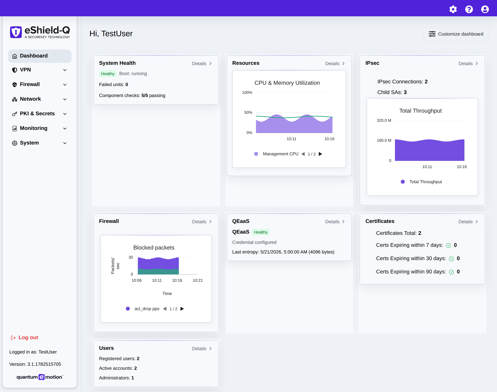
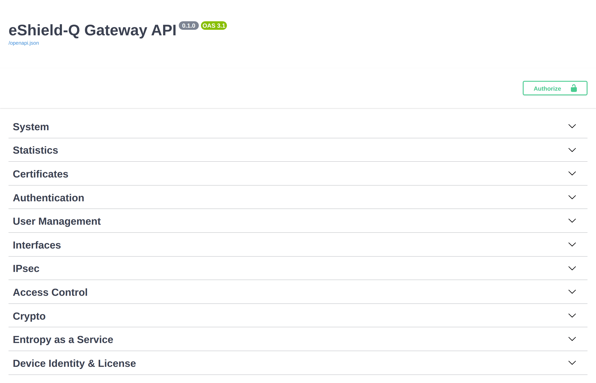

.. _getting_started:

Getting Started
===============

.. _api_docs:

Web Interface
-------------
The eShield-Q Gateway Web Interface can be used to manage the eShield-Q Gateway system using a web browser. 

Use a browser to access the eShield-Q Gateway Web Interface:

.. code-block:: console

    firefox https://<management_ip_address>/

The eShield-Q Gateway Web Interface allows management and monitoring of the eShield-Q Gateway:

|

HTTPS REST API
--------------
The REST API is used to manage the eShield-Q Gateway system over HTTPS. 
The initial HTTPS access is secured using a self-signed certificate. 
We recommended to use a CA signed certificate see :ref:`https_certificates`.

The REST API is the recommended access method for the eShield-Q Gateway and supports all 
management operations. The CLI is also used for management but supports only a limited set of management operations.

Use a browser to access the eShield-Q Gateway REST API Schema Documentation:

.. code-block:: console

    firefox https://<management_ip_address>/api/docs

The eShield-Q Gateway REST API Schema Documentation is OpenAPI 3.0 compatible and looks like the following:

|

.. _cli_docs:

Command Line Interface
----------------------

The Command Line Interface (CLI) is used to manage the eShield-Q Gateway system over SSH or through the serial console.

In Azure access the serial console using the Azure Portal:

* Access the the `Virtual Machines` then select your eShield-Q Gateway VM. 
* Click on `Diagnose and solve Problems` then search for the `serial console`.
* Launch the Serial Console to access the CLI. 

CLI access over SSH is also supported see :ref:`ssh_user_mgmt`.

The CLI supports documentation via the ``?`` command.

.. _python_client:

Python Client (SDK)
-------------------
The Python client modules are a reference implementation used to manage the eShield-Q Gateway using the 
REST API and the SSH command line. 

The client libraries will be available from Quantum eMotion (|TBD-LINK|).

Extensions of the client modules will be available in the future to allow management of 
a large network of eShield-Q Gateways.

Next Steps:
Follow the :ref:`quick_start` checklist, or add users and log in to the VM —
see :ref:`user_management`.