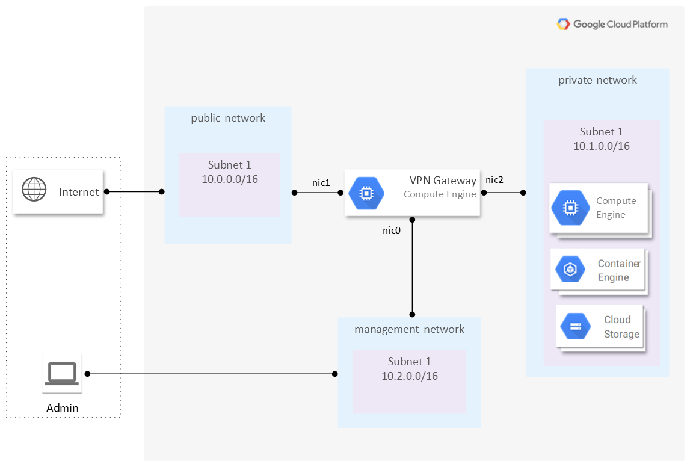

.. _google_overview:

---------------------------------
eShield-Q Gateway in Google Cloud
---------------------------------

The eShield-Q Gateway is available for the `Google Cloud <https://console.cloud.google.com/marketplace>`_.

This section describes how the eShield-Q Gateway integrates into a Google Cloud network.
The eShield-Q Gateway can be used to protect a Virtual Private Cloud (VPC) hosted in Google Cloud.
Using Google VPC peering, the eShield-Q Gateway can aggregate multiple private networks in Google Cloud and 
connect to remote cloud or on-premises network(s).

eShield-Q Gateway requires three network interfaces: a Management, a Private Network (LAN), and a Public-Network (WAN). 
The LAN and WAN interfaces must be configured using the GVNIC network interface and support high speed traffic.
The MGMT and WAN interfaces require Public IP addresses as they are accessible on the internet. 
The MGMT interface is further protected using Firewall rules that allow only SSH and HTTPS traffic to the MGMT Interface. 
The LAN interface use Network Routes to direct traffic destined for remote private networks through the eShield-Q Gateway.

The minimum virtual machine requirements for the eShield-Q Gateway is an X86-64 based platform with at least 8 vCPUs (e.g., c2-standard-8).
To achieve best performance a compute optimized instance type should be used. 

.. _install_google:

Google Cloud Installation
-------------------------
The `gcloud <https://cloud.google.com/sdk/docs/install>`_ utility can be used to setup the necessary resources for the eShield-Q Gateway. 

Terraform can be used with the eShield-Q Gateway Terraform Module (|TBD-LINK|).

Below is an example script to create the eShield-Q Gateway in Google Cloud - update the variables to match your account and network.

Create the Networks and Subnets for the eShield-Q Gateway:

.. code-block:: bash
    
    # update these to match your account
    PROJECT="my-project"
    REGION="us-west2"
    STORAGE_BUCKET="bucket-1"

    # Name the resources required by the eShield-Q Gateway
    WAN_NET_NAME="wan-vpc"
    WAN_PUBLIC_IP_NAME="wan-ip"
    WAN_SUBNET_NAME="wan-subnet"
    WAN_SUBNET="10.0.0.0/24"

    LAN_NET_NAME="lan-vpc"
    LAN_SUBNET_NAME="lan-subnet"
    LAN_SUBNET="10.0.1.0/24"

    MGMT_NET_NAME="mgmt-vpc"
    MGMT_PUBLIC_IP_NAME="mgmt-ip"
    MGMT_SUBNET_NAME="lan-subnet"
    MGMT_SUBNET="10.0.2.0/24"    

    # create Network and Subnets for WAN
    echo "Creating subnet $WAN_NET_NAME and $WAN_SUBNET_NAME"
    gcloud compute networks create ${WAN_NET_NAME} --subnet-mode custom
    gcloud compute networks subnets create ${WAN_SUBNET_NAME} \
    --network ${WAN_NET_NAME} --range ${WAN_SUBNET} --region ${REGION}

    # create Network and Subnets for LAN
    echo "Creating subnet $LAN_NET_NAME and $LAN_SUBNET_NAME"
    gcloud compute networks create ${LAN_NET_NAME} --subnet-mode custom
    gcloud compute networks subnets create ${LAN_SUBNET_NAME} \
    --network ${LAN_NET_NAME} --range ${LAN_SUBNET} --region ${REGION}

    # create Network and Subnets for MGMT
    echo "Creating subnet $MGMT_NET_NAME and $MGMT_SUBNET_NAME"
    gcloud compute networks create ${MGMT_NET_NAME} --subnet-mode custom
    gcloud compute networks subnets create ${MGMT_SUBNET_NAME} \
    --network ${MGMT_NET_NAME} --range ${MGMT_SUBNET} --region ${REGION}

Allocate public IPs for WAN and MGMT

.. code-block:: bash    

    # create new public IPs for WAN and MGMT (or use existing available public IPs)
    gcloud compute addresses create ${WAN_PUBLIC_IP_NAME} --region ${REGION}
    gcloud compute addresses create ${MGMT_PUBLIC_IP_NAME} --region ${REGION}

Create Firewall rules for the MGMT Network:

.. code-block:: bash

    # create the network Security Group for the MGMT subnet
    gcloud compute firewall-rules create allow-https-ssh \
    --network ${MGMT_NET_NAME} \
    --allow tcp:443,tcp:22 \
    --source-ranges 0.0.0.0/0  

Setup the SSH key pair:

.. code-block:: bash

    # save the private key in a secure location
    # used for SSH access to the eShield-Q Gateway
    PRIV_KEY_FILE="ssh_key"
    PUB_KEY_FILE="${PRIV_KEY_FILE}.pub"
    ssh-keygen -t rsa -b 4096 -N '' -f ${PRIV_KEY_FILE} -C ""
    
    # pre-pend 'ssh_admin:' to the public key (required)
    SSH_ADMIN_KEY_FILE="${PRIV_KEY_FILE}.pub.ssh_admin"
    echo "ssh_admin:$(cat ${PUB_KEY_FILE})" > ${SSH_ADMIN_KEY_FILE}
    echo "Using SSH Key ${SSH_ADMIN_KEY_FILE} for $vm_name"

Create the eShield-Q Gateway Virtual Machine:

.. note::

   The public Compute Engine image project and image family are **TBD**. Ask
   your Quantum eMotion contact for the current values.

.. code-block:: bash

    # The public image project and image family are TBD; substitute the values
    # from your Quantum eMotion contact, then update to the latest
    # eShield-Q Gateway version.
    IMAGE_PROJECT="<TBD-image-project>"
    IMAGE_FAMILY="<TBD-image-family>"

    ZONE="${REGION}-a"

    # chose a VM size that supports GVNIC, and has at least 8 vCPUs
    INSTANCE_NAME="eshieldq-gateway-vm1"
    MACHINE_TYPE="c2-standard-8"
    # GVNIC_QUEUES can grow depending on the number of vCPUs in the VM
    GVNIC_QUEUES="2"

    # create the eShield-Q Gateway VM
    gcloud compute instances create ${INSTANCE_NAME} \
    --image-project ${IMAGE_PROJECT} \
    --image-family ${IMAGE_FAMILY} \
    --machine-type ${MACHINE_TYPE} \
    --zone ${ZONE} \
    --metadata-from-file ssh-keys=${SSH_ADMIN_KEY_FILE} \
    --network-interface network=${MGMT_NET_NAME},subnet=${MGMT_SUBNET_NAME},address=${MGMT_PUBLIC_IP_NAME},stack-type=IPV4_ONLY,nic-type=VIRTIO_NET \
    --network-interface network=${WAN_NET_NAME},subnet=${WAN_SUBNET_NAME},address=${WAN_PUBLIC_IP_NAME},stack-type=IPV4_ONLY,nic-type=GVNIC,queue-count=${GVNIC_QUEUES} \
    --network-interface network=${LAN_NET_NAME},subnet=${LAN_SUBNET_NAME},no-address,stack-type=IPV4_ONLY,nic-type=GVNIC,queue-count=${GVNIC_QUEUES} \
    --can-ip-forward

.. note::
    The order of the Network Interfaces should be: MGMT, WAN, LAN. The eShield-Q Gateway uses 
    the assigned private IP address (based on Subnets in Google Cloud) to set the WAN and LAN interface roles on the system.
    These roles may be changed as needed.
    Using the below IP address scheme will ensure proper WAN and LAN role assignment: 
    
    The WAN Network Private IP address should be of the form: 10.X.0.X 
    The LAN Network Private IP address should be of the form: 10.X.1.X

    see :ref:`interface_role_assignment`

Initial Login 
------------------------------------------

Once the VM has been created, login using SSH to the VM:

.. code-block:: bash

    # The SSH Private Key file 
    PRIV_KEY_FILE="<path_to_SSH_private_key>"

    echo "MGMT Public IP:"
    MGMT_PUB_IP=$(gcloud compute instances describe ${INSTANCE_NAME} --zone $ZONE --format='get(networkInterfaces[0].accessConfigs[0].natIP)')

    ssh -i ${PRIV_KEY_FILE} ssh_admin@${MGMT_PUB_IP}

.. note::
    SSH and HTTPS are enabled by default for the VM.
    See :ref:`initial_user` for details on how to add an initial user.

.. _google_traffic_setup:

Traffic setup
-------------
To allow traffic in a private network (LAN) to be sent through the eShield-Q Gateway the following must be done:

1. Setup a Firewall rule to allow ingress LAN traffic to the eShield-Q Gateway:

.. code-block:: bash

    fw_name="lan-allow-all-ingress"
    gcloud compute firewall-rules create $fw_name \
    --network ${LAN_NET_NAME} \
    --allow all \
    --priority 1000 \
    --source-ranges 0.0.0.0/0

2. Setup a static route to send traffic through the eShield-Q Gateway:

.. code-block:: bash

    # get the Private IP address for the gateway's LAN subnet
    gw_ip=$(gcloud compute instances describe ${INSTANCE_NAME} --zone ${ZONE} --format='get(networkInterfaces[2].networkIP)')
    
    route_name="remote-lan-to-eshieldq-gateway"
    # Route traffic in 10.0.1.0/24 through the eShield-Q Gateway
    gcloud compute routes create $route_name \
    --network ${LAN_NET_NAME} \
    --next-hop-address ${gw_ip} \
    --destination-range 10.0.1.0/24    