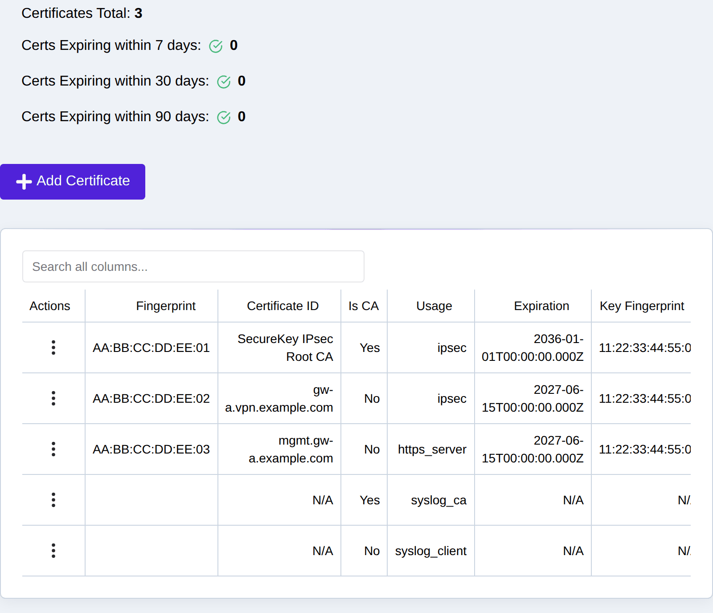
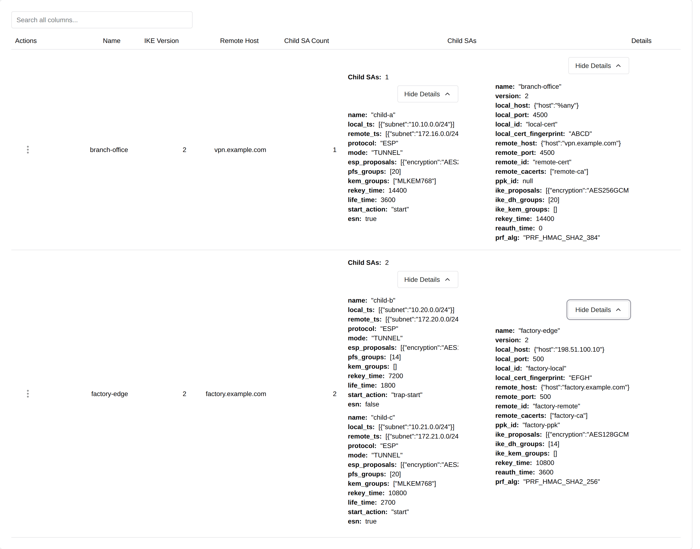
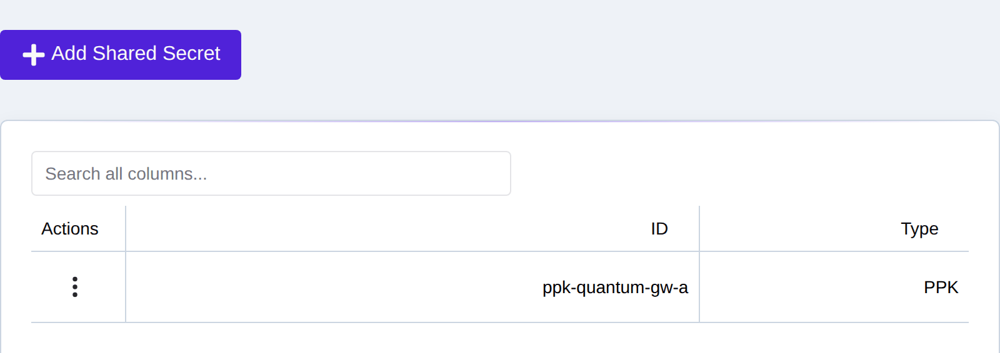

.. _ipsec_setup:

IPsec Setup
===========

For an end-to-end walkthrough that brings up a tunnel between two gateways —
CA creation, certificates, ACLs, connection, and verification — see
:ref:`site_to_site`. This chapter is the reference for the individual pieces.

.. _ipsec_certificates:

Setup IPsec Certificates
------------------------

The eShield-Q Gateway supports certificate based IKEv2 Security Associations.

The eShield-Q Gateway Web UI Certificates page is used to install and manage IPsec certificates:

|

To setup IKEv2 Certificates using the REST API:

(*Pre*) Generate a CA Root Certificate and Private Key pair which will be used to sign the device Certificate.
see :ref:`ca_generation`

* Export a Certificate Signing Request: POST ``/api/certs/v1/signing-request`` see :ref:`cert_csr`
* Sign the CSR with the CA Root Private Key see :ref:`cert_signing`.
* Upload the signed certificate to the eShield-Q Gateway via the POST ``/api/certs/v1/signed_csr`` endpoint with the `usage` field set to `IPSEC`
* Verify the Certificate details using the GET ``/api/certs/v1/certs`` and ``/api/certs/v1/details``

.. _ipsec_connections:

IPsec Connections
-----------------
An IPsec Connection is a set of parameters to define an IKE (phase 1) connection and a set of (phase 2) Child Security Associations.
Peer authentication is certificate or EAP based only — Pre-Shared Key (PSK)
authentication is not supported due to the lack of key security. IKEv2 is the
default and recommended version; IKEv1 can be selected per connection for
legacy interoperability but does not support EAP (remote access) or
post-quantum key exchange.

The eShield-Q Gateway requires a user to upload then activate the connection, activation loads the connection into the dataplane. 
Details of the active (loaded) connections along with the details of the child SAs are available via the REST API and the Web UI.

Active Connections and Connection Details and Statistics are available on the Web UI **VPN -> Active Sessions** page:

.. image:: images/UI/IPsec_Active_Sessions.png
    :align: center

|

Connections can be created, modified, deleted and activated using the Web UI **VPN -> Connections** page:

|

IPsec Connections are managed using the REST API:

* Upload a new connection: POST ``/api/ipsec/v1/connections``
* Activate a connection: POST ``/api/ipsec/v1/connections/loaded/<name>``
* Deactivate a connection: DELETE ``/api/ipsec/v1/connections/loaded/<name>``
* Get the list of saved connections: GET ``/api/ipsec/v1/connections``
* Get the list of active connections: GET ``/api/ipsec/v1/connections/loaded``
* Delete a connection: DELETE ``/api/ipsec/v1/connections``

.. _security_associations:

IPsec Security Associations
---------------------------
IPsec Connections define a set of Security Associations (SAs) that 
will be installed on the eShield-Q Gateway. IPsec ESP Tunnel Mode is used by default.

Each Security Association defines a secure tunnel between the eShield-Q Gateway and a remote peer.

Active SAs are managed using the Web UI VPN -> Active Sessions page and selecting the 
Actions Menu item for the Active SA to activate or terminate:

.. image:: images/UI/IPsec_Activate_SA_Menu.png
    :align: center
    :scale: 50%

|

Security Associations are managed using the REST API. 

* Get the list of active SAs: GET ``/api/ipsec/v1/sas``
* Force Initiation of an SA: POST ``/api/ipsec/v1/sas/initiate-child``
* Force Termination of an SA: POST ``/api/ipsec/v1/sas/terminate-child``
* Get list of a Connection's SAs: GET ``/api/ipsec/v1/connections`` use the `children` field for the list of SAs

.. _sa_forwarding_state:

Checking whether a tunnel is carrying traffic
---------------------------------------------
An SA in the **ESTABLISHED** state has completed its negotiation. That is not
the same as carrying traffic: a tunnel can remain established while forwarding
nothing. The **Forwarding** column on the **VPN -> Active Sessions** page
reports which of the two is true, and shows one of:

* **yes** -- the packet and byte counters for this SA advanced within the last
  few seconds.
* **idle Ns** -- the counters last advanced N seconds ago. An idle tunnel is
  normal when nothing is being sent through it; it is only a fault if traffic
  is expected.
* **no traffic yet** -- the counters have not advanced since the SA was
  established. This is different from a tunnel that stopped, and is what a
  newly established SA shows until the first packet crosses it.
* **unknown** -- the appliance's statistics sampler has stopped, or the browser
  could not reach the endpoint. The previous reading is deliberately **not**
  shown, because it describes the past and cannot answer whether the tunnel is
  forwarding now.

The **Child SAs** cell shows a **"N superseded"** badge when more child SAs are
present than the connection configures. One extra briefly during a rekey is
normal. A count that stays above the configured number means superseded child
SAs are not being cleaned up, and should be reported.

Over the REST API: GET ``/api/ipsec/v1/sas/liveness``. It returns one record per
active IKE SA with ``forwarding``, ``idle_seconds``, a ``child_sa_states``
census, and ``sample_age_seconds``. The appliance samples this once a second, so
polling faster does not produce fresher numbers; a large ``sample_age_seconds``
means the sample is stale and the rest of the record should not be trusted.

.. _sa_rekey:

Rekeying and reauthenticating a session
---------------------------------------
Both happen automatically when the connection's configured ``rekey_time`` and
``reauth_time`` elapse. They can also be triggered on demand from the
**Actions** menu of a row on the **VPN -> Active Sessions** page:

* **Rekey SA** -- negotiates fresh keys on the existing authenticated session.
  The replacement is installed before the old SA is retired, so traffic is not
  expected to stop.
* **Reauthenticate SA** -- both peers re-run authentication and every child SA
  is re-established under a new IKE SA. Traffic on the session pauses briefly
  while the child SAs are rebuilt. This is the heavier of the two: use it to
  force credentials to be re-checked, not as a routine action.

On a remote-access connection each connected client has its own session. The
action applies to the session in the row it was opened from; the confirmation
dialog names that session. If it instead warns that **every** active session is
affected, the request is not scoped to one client and will disconnect and
re-authenticate all of them.

Over the REST API: POST ``/api/ipsec/v1/sas/rekey`` with ``connection_name``,
optionally ``child_name`` (rekey one child SA rather than the IKE SA),
``session_id`` (act on one session rather than all of them, using the
``uniqueid`` from the SA listing), and ``reauth``.

The response reports ``matched`` -- how many live SAs the request selected.
**A response with ``matched`` of 0 means nothing was rekeyed**, even though the
request itself succeeded: the selector named no active SA. Check this rather
than the status code alone. ``reauth`` cannot be combined with ``child_name``,
and a ``session_id`` belonging to a different connection is refused.

.. _post_quantum_safe_mlkem:

Post Quantum Safe IPsec 
-----------------------
eShield-Q Gateway supports both Postquantum Preshared Keys (PPK, RFC 8784) 
and Post Quantum Safe ML KEM (RFC 9370 and RFC 9242) for IKEv2 connections.

----------------------
Post Quantum Safe PPKs
----------------------
An IKEv2 PPK is configurable using the Web UI and REST API. 
First a shared secret (PPK) must be imported to the eShield-Q Gateway. 
This shared-secret is identified using a unique ID string supplied by the user. 
The data is supplied as a Hexadecimal String up to 32 bytes long (64 characters).

Once uploaded, a PPK can be used in an IKEv2 connection by selecting from the list of loaded PPKs.
When the connection is activated, the eShield-Q Gateway will set the IKEv2 PPK and the SA status will indicate that PPK is in use.
Note the peer must also support PPK and have the identical PPK ID and data set.

Using the REST API: POST ``/api/certs/v1/shared_secret`` 
Using the Web UI: PKI & Secrets -> Shared Secrets

|

-------------------------
Post Quantum Safe ML KEMs
-------------------------
IKEv2 ML KEM (RFC 9370 and RFC 9242) are supported. 

IKEv2 Connections can be configured with additional KEMs to support Post Quantum Safe Key Exchange.
Supported KEMs are **ML-KEM-768** and **ML-KEM-1024**; ML-KEM-1024 is the CNSA v2.0 selection.

To configure connections to use additional Post Quantum Key Exchange Methods,
select "mlkem1024" (or "mlkem768") from the list of available KEMs in the Web UI. Default is None.
Note PPK can be used with additional Key Exchange Methods.

.. image:: images/UI/Post_Quantum_IPsec_Options.png
    :align: center 
    :scale: 50%

|

Next Steps
-----------
System Monitoring see :ref:`system_monitoring`