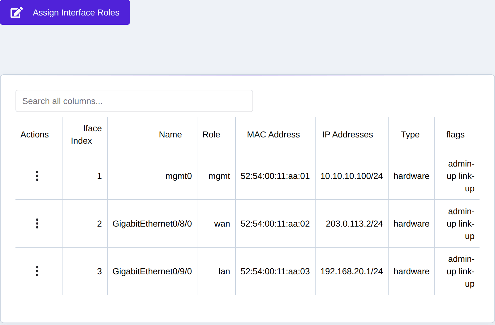
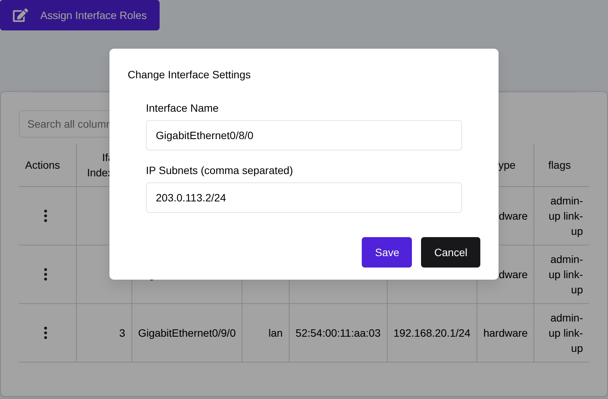
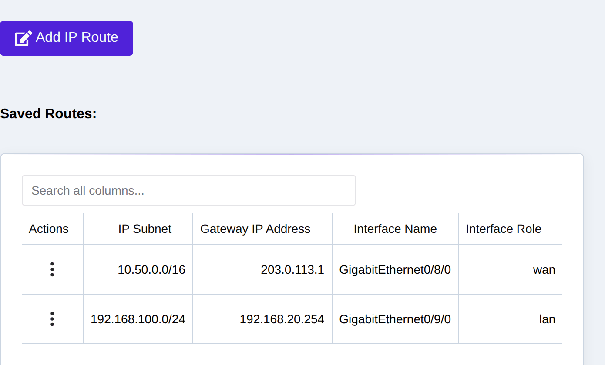
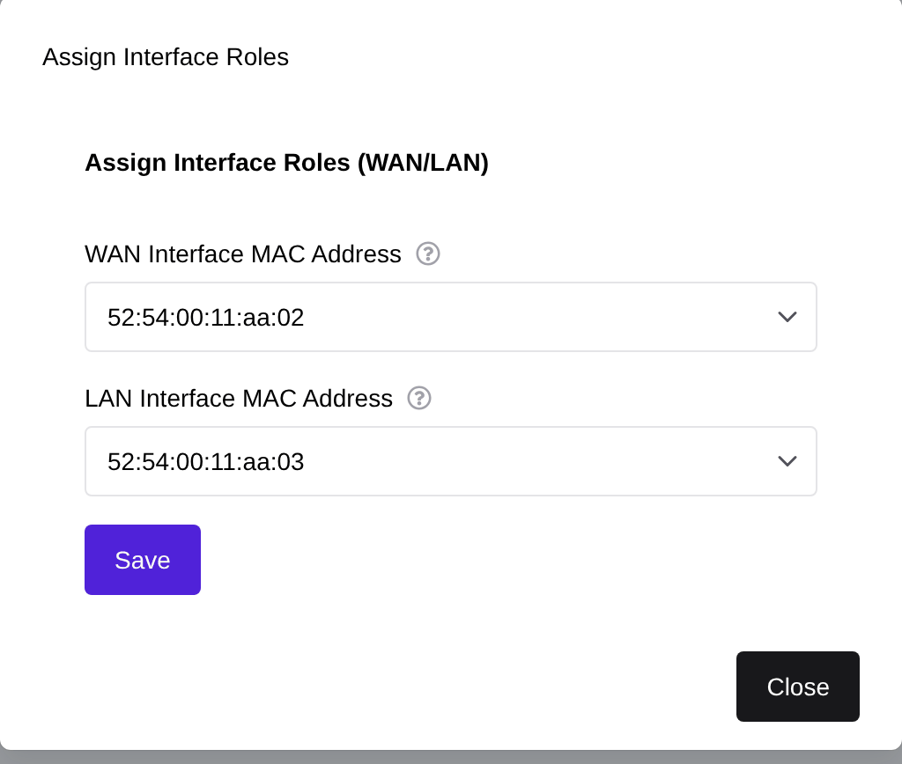
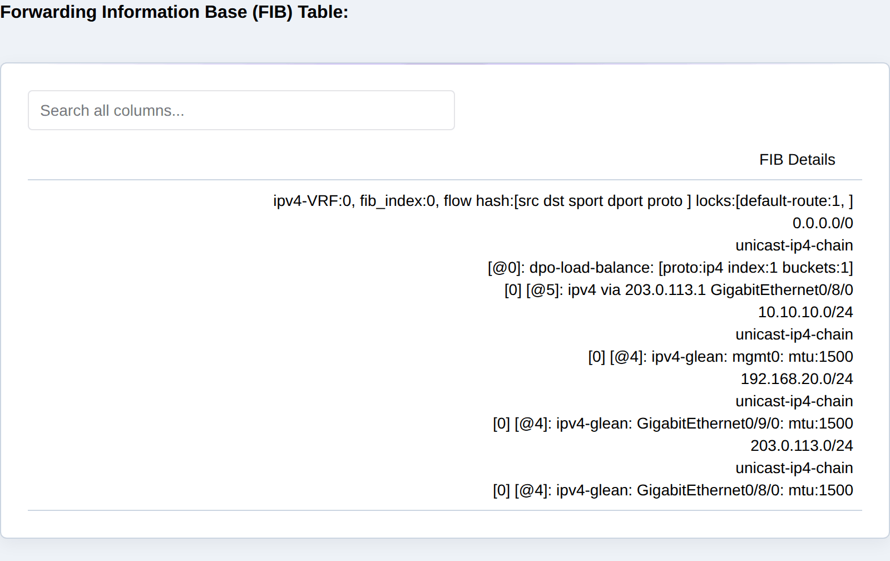

.. _network_setup:

Network Setup
=============
The eShield-Q Gateway supports multiple interfaces Roles: LAN, WAN, and MGMT.
The eShield-Q Gateway allows administrators to assign IP Addresses and Routes to interfaces.
The eShield-Q Gateway supports IPv4 addresses. IPv6 will be supported in the future.

.. _interface_setup:

Interface Address Setup
-----------------------

The Web UI Network page is used to manage Interface Addresses.

|

--------------------------
Modify Interface Addresses
--------------------------

Add or modify existing Network Interface Addresses on the Web UI Network -> Interfaces page.
Select the Interface to modify and click on the Actions Menu -> Edit Interface Settings.

|

.. _route_setup:

Route Setup
-----------
Routes are used to forward packets from one interface to another.
The eShield-Q Gateway allows administrators to manage system routes for the LAN and WAN interfaces.

The Web UI **Network -> Routing** page is used to manage Routes.

|

.. _interface_role_assignment:

Interface Role Assignment
-------------------------
The eShield-Q Gateway supports multiple interfaces Roles: LAN, WAN, and MGMT.
Upon initialization the eShield-Q Gateway attempts to assign interfaces a LAN or WAN role based on IP address assignments.

The eShield-Q Gateway allows users to re-assign the role of an interface to be either LAN or WAN.
A Reboot is required to take effect.

The Web UI Network -> Interfaces -> Assign Interface Roles is used to manage Interface Roles.

|

.. _fib_table:

FIB Table
---------
The eShield-Q Gateway determines how network packets are routed based on multiple decision points including:
the system routes, IPsec connections and filtering rules. 
The Forwarding Information Base (FIB) table is used to determine the routing path for a packet.

Direct manipulation of the FIB table is not allowed as it is a combination of routing and security settings. 
The FIB is useful to troubleshoot routing problems.

The Web UI Network -> FIB displays the current FIB Table.

|

.. _network_api:

Network REST API
----------------
The same interface, route, and role operations are available through the REST
API under ``/api/interfaces/v1``:

* List interface settings: GET ``/api/interfaces/v1/settings``
* Set an interface's IP address: POST ``/api/interfaces/v1/<iface_name>/ip``
  (DELETE to remove)
* Assign interface roles (LAN/WAN): POST ``/api/interfaces/v1/role`` (a reboot
  is required to take effect)
* List / add a route: GET ``/api/interfaces/v1/ip/routes-saved``,
  POST ``/api/interfaces/v1/ip/route``
* View the live FIB: GET ``/api/interfaces/v1/ip/routes``

