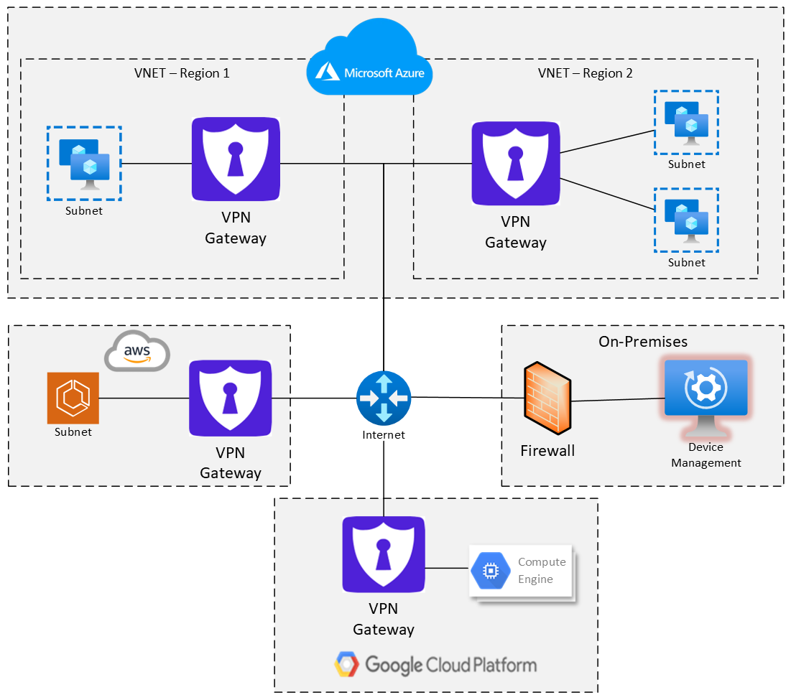

.. _overview:

.. |SecureKey (TM)| unicode:: SecureKey U+2122
   .. with trademark sign

Overview
========

The eShield-Q Gateway is an IPsec VPN and Firewall gateway.
Combining the protections of the |SecureKey (TM)| Cryptographic Library and hardened open-source software
including VPP, DPDK, StrongSwan, and FastAPI, the eShield-Q Gateway offers next generation security and performance.
Protecting multi-cloud networks to secure enterprises from advanced threats.

.. _conops:

Concept of Operations
---------------------

The eShield-Q Gateway + Firewall lies at the heart of a secure cloud network. 
As a Point-to-Point VPN, it is used to connect private networks across the internet.
As a Stateful and Stateless Firewall it has the ability to filter inbound and outbound network traffic.
The eShield-Q Gateway uses the strongest commercially available IPsec Encryption standards to encrypt traffic between networks.

The eShield-Q Gateway protects multi-cloud networks and can be used as a cloud gateway for hybrid networks. 
The below image shows an example network protected by the eShield-Q Gateway. 
The eShield-Q Gateway virtual machine is a gateway device and a traffic aggregator, allowing multiple 
private network segments to connect securely. 

Each cloud provider has their own concept of virtual networks. eShield-Q Gateway is designed to operate across all cloud providers,
details for networking specific to each cloud provider are found in the following sections:

* :ref:`Azure Cloud <azure_overview>`
* :ref:`Google Cloud <google_overview>`
* :ref:`AWS Cloud <aws_overview>`

.. _security:

Security
--------

The eShield-Q Gateway was designed with security at the forefront. 
The eShield-Q Gateway uses the Patent Pending |SecureKey (TM)| Cryptographic Library to protect keys and secure networks beyond existing commercial standards.

More information about the |SecureKey (TM)| Cryptographic Library can be found at https://www.quantumemotion.com

The eShield-Q Gateway supports the following security standards:

Data Plane:

* CNSA v1.0 Algorithm defaults for IKE and IPsec see: `CNSA v1.0 <https://media.defense.gov/2021/Sep/27/2002862527/-1/-1/0/CNSS%20WORKSHEET.PDF>`_
* CNSA v2.0 ML KEM for IKEv2 (RFC 9370, RFC 9242) see: `CNSA v2.0 <https://media.defense.gov/2022/Sep/07/2003071836/-1/-1/0/CSI_CNSA_2.0_FAQ_.PDF>`_
* Postquantum Preshared Key (PPK, RFC 8784) for IKEv2
* Certificate keys: RSA (3072-bit+) and ECC (P-384+) enforced
* Certificate / EAP Based Authentication (IKEv2)
* Configurable per-connection algorithms (AES-GCM/CBC, SHA-2, ECP/MODP/Curve25519 groups) with an optional CNSA-only enforcement mode
* *Disallow*: Pre-Shared Keys (PSK); IKEv1 available only for legacy interoperability (IKEv2 recommended)
   
Management Interface:

* HTTPS using TLS 1.2+
* Password Based Authentication + Multi-Factor Authentication (MFA)
* Client Certificate Authentication (Mutual TLS)
* Role Based Access Control (RBAC)
* OpenAPI 3.0 compatible REST API
* Secure Shell (SSH) certificate-based authentication
* Command Line Interface (CLI) accessible over SSH and serial console
* Authenticated + Encrypted Syslog over TLS
* Encrypted + Authenticated Software Update using our secure servers

.. _performance_features:

Performance and Features
------------------------

The eShield-Q Gateway and Firewall uses high performance, open-source software
enhanced with SecureKey Cryptography for a data plane capable of bandwidths above 10 Gbps+ (AES-256-GCM).
The eShield-Q Gateway bandwidth scales up when deployed on larger Virtual Machines with more vCPUs.

The eShield-Q Gateway supports the following features and standards:

* IPsec VPN
   * Certificate Based Authentication using IKEv2
   * Route Based Point-to-Point (site-to-site) IPsec
   * Remote-access (dial-up) IPsec for road-warrior clients (EAP-TLS, EAP-RADIUS, EAP-MSCHAPv2)
   * High Speed AES-256-GCM encryption (10 Gbps+)
* Access Control List (ACL) based firewall
   * Stateful and Stateless Modes
   * Layer2-4 Filtering
* Dynamic Name Server (DNS) + DNS Security Extensions (DNSSEC)
* Network Time Protocol (NTP)
* Syslog + Authenticated/Encrypted Syslog over TLS
* Dynamic Host Configuration Protocol (DHCP)
* Certificate Signing Requests (CSR)
  
  

