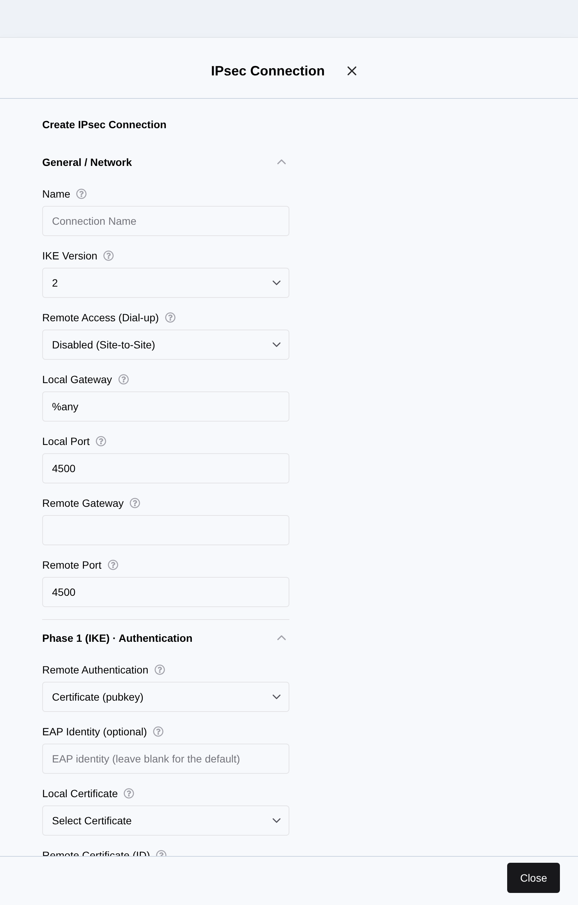
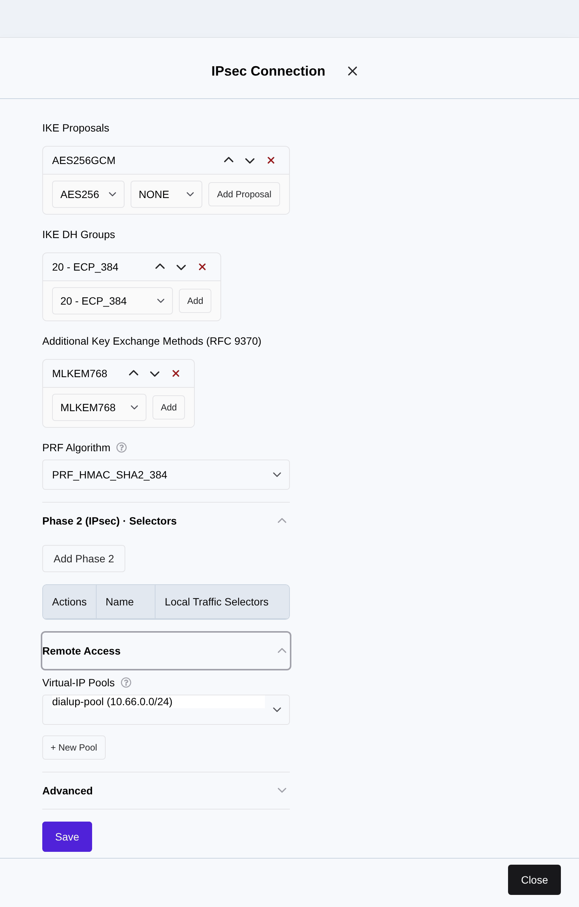
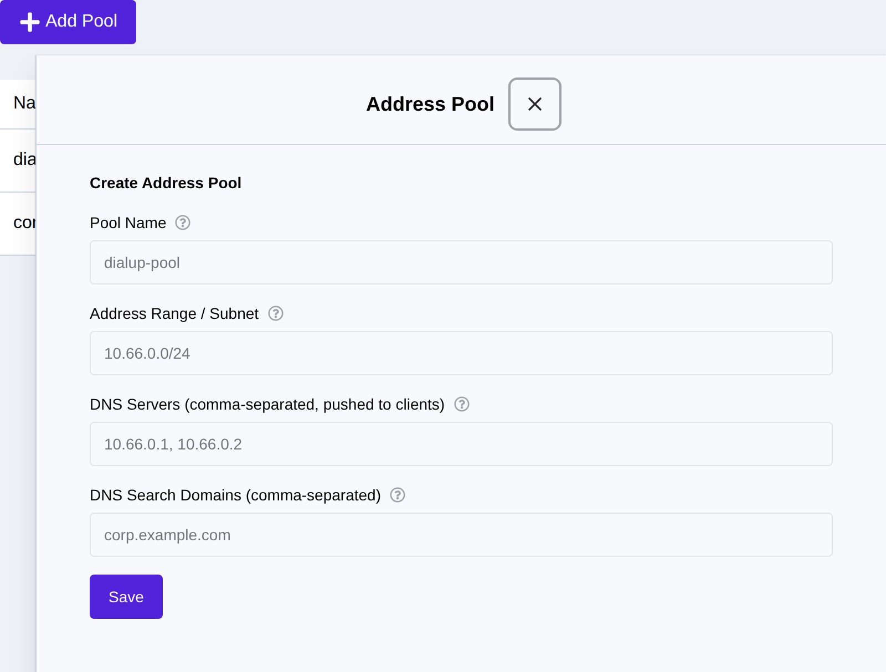
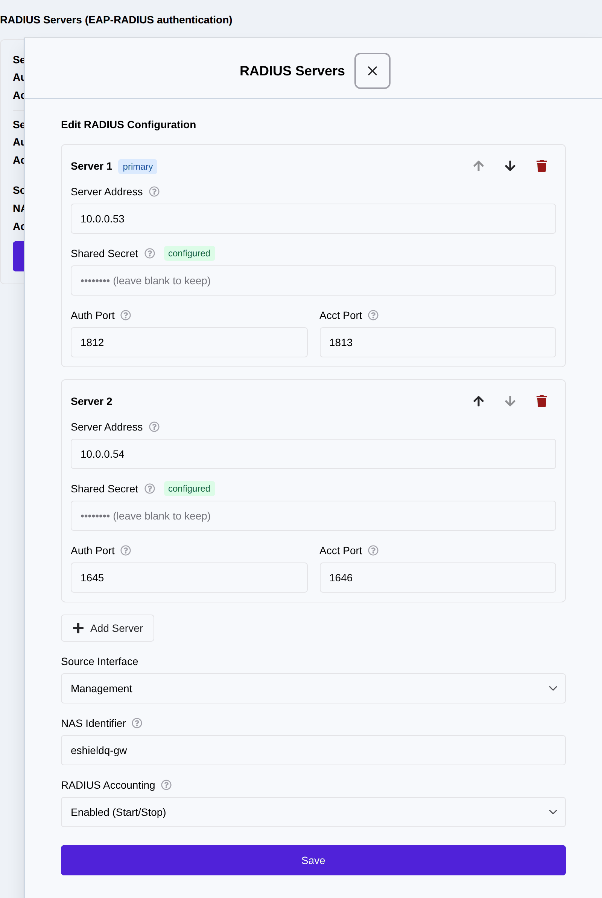
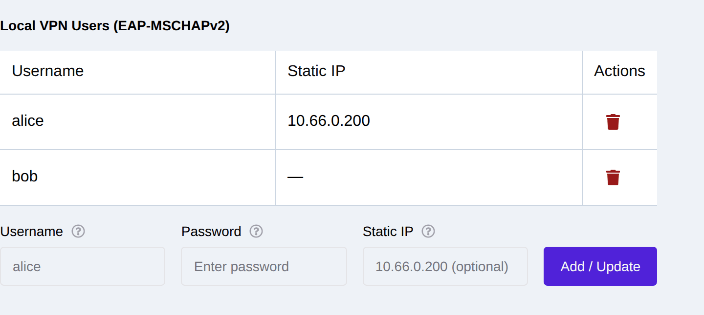
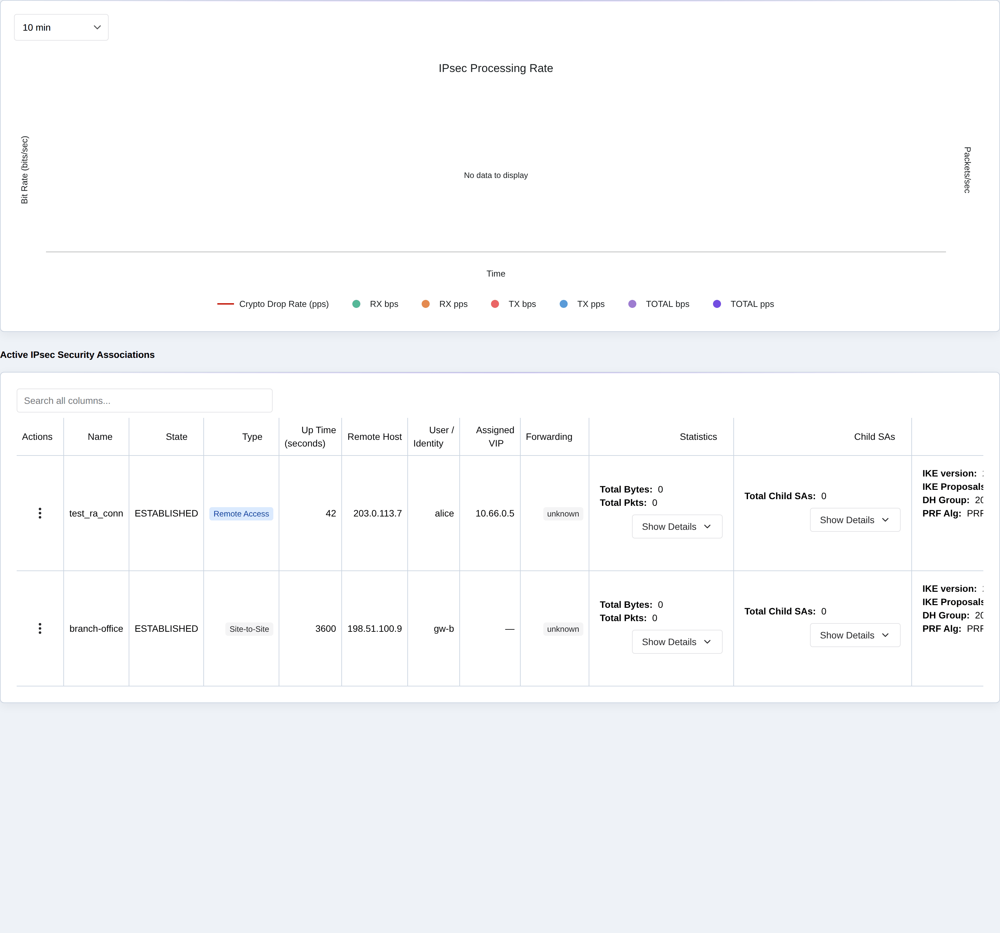

.. _remote_access_vpn:

Remote-Access (Dial-up) VPN
===========================

In addition to site-to-site IPsec (see :ref:`ipsec_setup`), the eShield-Q Gateway
acts as a **remote-access (dial-up) IKEv2 responder**: individual road-warrior
clients — laptops and phones running the native Windows, macOS/iOS, or
strongSwan clients, or FortiClient — dial in, authenticate a *user* (not just a
peer), and are handed a **virtual IP** from an address pool along with pushed
DNS settings and split-tunnel routes.

A remote-access connection is an ordinary IPsec connection with **Remote Access
(Dial-up)** enabled: the gateway listens as ``%any`` (accepts any client
address) and each dial-in produces its own Child SA. All the strong defaults of
the site-to-site path apply — IKEv2, AES-256-GCM, ECP-384, MOBIKE, optional
post-quantum key exchange (ML-KEM, RFC 9370) — with IKE fragmentation and DPD
enabled so native clients interoperate out of the box.

The remote-access screens are grouped under the Web UI **VPN** section: *Active Sessions*, *Connections*,
and *Remote Access* (which collects *Address Pools*, *RADIUS*, *Directory
(LDAP / AD)*, and *Local Users*).

.. _remote_access_auth_methods:

Client Authentication Methods
-----------------------------

Remote-access clients are authenticated with an **EAP** method, selected per
connection in the **Remote Authentication** field. Three methods are supported:

* **EAP-TLS (client certificate)** — ``eap-tls``. Each client presents an X.509
  client certificate, reusing the existing certificate lifecycle
  (see :ref:`ipsec_certificates` and :ref:`certificates`). Strongest
  option; no passwords.
* **EAP-RADIUS (username / password)** — ``eap-radius``. The gateway forwards
  the client's EAP credentials to one or more RADIUS servers. This is the
  standard interoperability path for the **native Windows, macOS/iOS, and
  FortiClient** clients, which default to EAP-MSCHAPv2 forwarded to RADIUS, and
  it supports RADIUS-driven MFA (Access-Challenge) and accounting.
  See :ref:`remote_access_radius`.
* **EAP-MSCHAPv2 (local users)** — ``eap-mschapv2``. Username/password
  authentication against an **on-gateway local user database**, with no RADIUS
  server required. See :ref:`remote_access_local_users`.

Username/password authentication can also be served directly from your **LDAP or
Active Directory** server, with no RADIUS server anywhere: set the connection to
*EAP-RADIUS* and configure a directory, and the gateway authenticates against it
using an on-appliance broker. VPN accounts are then the accounts you already
manage, and group membership decides who may connect. See
:ref:`directory_auth`.

.. _remote_access_connection:

Creating a Remote-Access Connection
------------------------------------

Create or edit a connection from the Web UI **VPN -> Connections** page.
In the connection drawer set **Remote Access (Dial-up)** to *Enabled*, leave the
**Remote Gateway** empty (the gateway responds to ``%any``), and choose the
**Remote Authentication** method:

|

Expand the **Remote Access** section to attach one or more **Virtual-IP Pools**.
Clients that establish on this connection are leased an address from the
selected pool(s); the connection's Phase 2 traffic selectors define the
split-tunnel networks reachable over the tunnel. A **+ New Pool** shortcut
creates a pool inline (see :ref:`remote_access_pools`):

|

Saved connections are listed on the **VPN -> Connections** page, where
they are activated (loaded into the dataplane), edited, or deleted. A
remote-access connection must be **activated** before clients can dial in:

.. image:: images/UI/RemoteAccess_Saved_Connections.png
    :align: center
    :scale: 50%

|

Using the REST API:

* Create a connection (set ``remote_access = true`` and ``remote_auth_method``):
  POST ``/api/ipsec/v1/connections``
* Modify a connection: PUT ``/api/ipsec/v1/connections/<conn_name>``
* Activate a connection: POST ``/api/ipsec/v1/connections/loaded/<conn_name>``
* Deactivate a connection: DELETE ``/api/ipsec/v1/connections/loaded/<conn_name>``
* List saved / active connections: GET ``/api/ipsec/v1/connections`` /
  GET ``/api/ipsec/v1/connections/loaded``

.. _remote_access_pools:

Virtual-IP Address Pools
------------------------

An address pool is the range of virtual IPs leased to dial-up clients, plus the
network configuration pushed to them. Manage pools on the Web UI
**VPN -> Remote Access** page (Address Pools section):

|

Each pool defines:

* **Pool Name** — referenced from a remote-access connection.
* **Address Range / Subnet** — the virtual-IP range (e.g. ``10.66.0.0/24``).
* **DNS Servers** — pushed to the client for name resolution over the tunnel.
* **DNS Search Domains** — split-DNS search domains pushed to the client.

Using the REST API:

* Create a pool: POST ``/api/ipsec/v1/pools``
* Modify a pool: PUT ``/api/ipsec/v1/pools/<pool_name>``
* Delete a pool: DELETE ``/api/ipsec/v1/pools/<pool_name>``
* List pools: GET ``/api/ipsec/v1/pools``

.. _remote_access_radius:

RADIUS Servers (EAP-RADIUS)
---------------------------

When a connection uses **EAP-RADIUS**, the gateway forwards client EAP
credentials to the RADIUS servers configured on the Web UI **VPN -> Remote Access (RADIUS)**
page. Multiple servers form an **ordered failover list**: the gateway tries the
first server and fails over to the next if it is unreachable, so a dead primary
does not lock users out.

|

For each server configure the **Server Address**, **Shared Secret**, and the
**Auth**/**Acct** ports (defaults 1812/1813). Use the up/down controls to set
failover order and **Add Server** for additional servers. Global options are the
**Source Interface** the gateway sends RADIUS requests from, the **NAS
Identifier**, and a **RADIUS Accounting** toggle (relays Start/Stop and passes
through MFA / Access-Challenge exchanges).

.. note::
   Per-server **shared secrets are write-only**: they are never returned by the
   API or shown in the UI. A configured server displays a *secret set* badge,
   and secret fields are blank on edit ("leave blank to keep"). Enter a value
   only to set or replace it.

Using the REST API:

* Set the RADIUS configuration (servers + options): POST ``/api/ipsec/v1/radius``
* Get the current configuration (no secrets): GET ``/api/ipsec/v1/radius``
* Clear the configuration: DELETE ``/api/ipsec/v1/radius``

.. _remote_access_local_users:

Local VPN Users (EAP-MSCHAPv2)
------------------------------

For deployments without a RADIUS server, the gateway can authenticate dial-up
users against a **local user database** using EAP-MSCHAPv2. Manage users on the
Web UI **VPN -> Remote Access (Local Users)** page:

|

Each user has a **Username**, a **Password**, and an optional **Static IP**
(see :ref:`remote_access_static_ip`). Attach a connection with **Remote
Authentication** set to *EAP-MSCHAPv2 (local users)* to authenticate against
this database.

.. note::
   User **passwords are write-only**: they are stored encrypted, never returned
   by the API, and only entered in this form. Re-submitting a username with a
   new password updates it.

Using the REST API:

* Add or update a user: POST ``/api/ipsec/v1/users``
* Delete a user: DELETE ``/api/ipsec/v1/users/<username>``
* List users (no passwords): GET ``/api/ipsec/v1/users``

.. _remote_access_static_ip:

Static Per-User IP Address
--------------------------

A user can be pinned to a fixed virtual IP instead of receiving a dynamic
address from the pool:

* **RADIUS users** — the RADIUS server returns a ``Framed-IP-Address`` attribute
  and the gateway assigns exactly that address. Reference the special
  strongSwan sentinel pool by setting the connection's pool to ``radius`` so the
  server-supplied IP is honored.
* **Local users** — set the **Static IP** field on the user (e.g.
  ``10.66.0.200``). The address must lie within the connection's address pool
  range.

.. _remote_access_client_profile:

Client Profile Export
---------------------

To simplify client provisioning, the gateway can derive an importable **client
profile** from a saved remote-access connection — the server address, client
identity, authentication type, and split-tunnel networks — so operators do not
have to transcribe settings onto each device.

Using the REST API:

* Export a client profile: GET ``/api/ipsec/v1/connections/<conn_name>/client-profile``

.. _remote_access_sessions:

Monitoring and Disconnecting Sessions
-------------------------------------

Active dial-up sessions appear alongside site-to-site SAs on the Web UI
**VPN -> Active Sessions** page. Remote-access sessions are tagged **Remote
Access** and show the authenticated **User / Identity** and the **Assigned VIP**
leased from the pool:

|

An operator can forcibly disconnect an individual client from the row's Actions
menu (terminating that IKE session by its unique id).

Using the REST API:

* List active SAs (includes ``assigned_vips`` and the remote identity):
  GET ``/api/ipsec/v1/sas``
* Disconnect a single session: POST ``/api/ipsec/v1/sas/terminate-session/<unique_id>``

Client Interoperability
-----------------------

Step-by-step configuration guides for each client — including the required
Windows PowerShell crypto settings, Apple profiles, strongSwan configuration,
and RADIUS server examples — are in :ref:`remote_access_clients`.

.. list-table::
   :header-rows: 1
   :widths: 40 60

   * - Client
     - Recommended gateway auth method
   * - Windows native IKEv2
     - EAP-RADIUS (client uses EAP-MSCHAPv2)
   * - macOS / iOS native
     - EAP-RADIUS or EAP-TLS
   * - FortiClient
     - EAP-RADIUS
   * - strongSwan / Linux
     - EAP-TLS or EAP-MSCHAPv2 (local users)

Next Steps
----------
Certificate management for EAP-TLS clients see :ref:`certificates`.
Session monitoring see :ref:`system_monitoring`.
