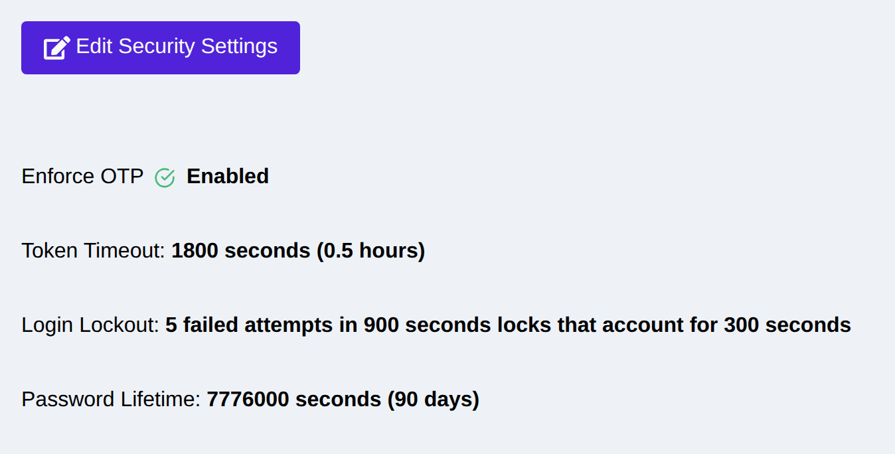
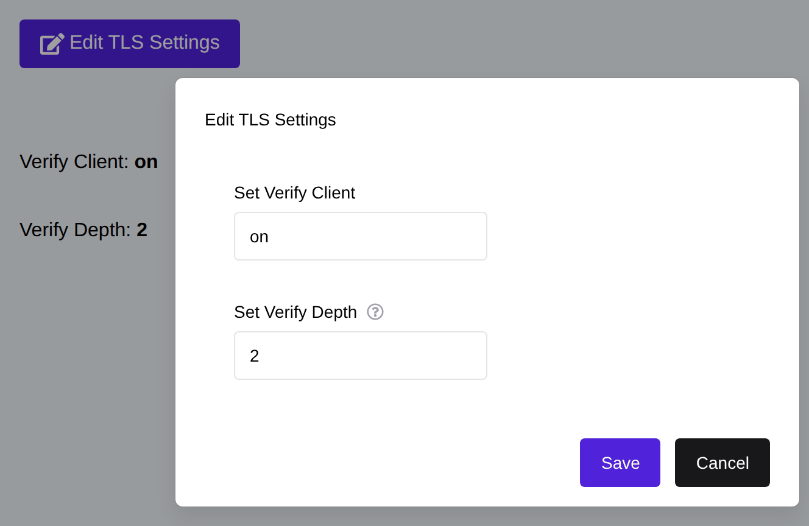
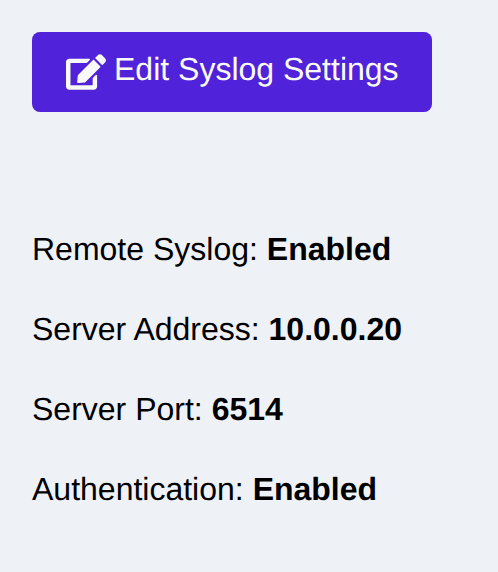
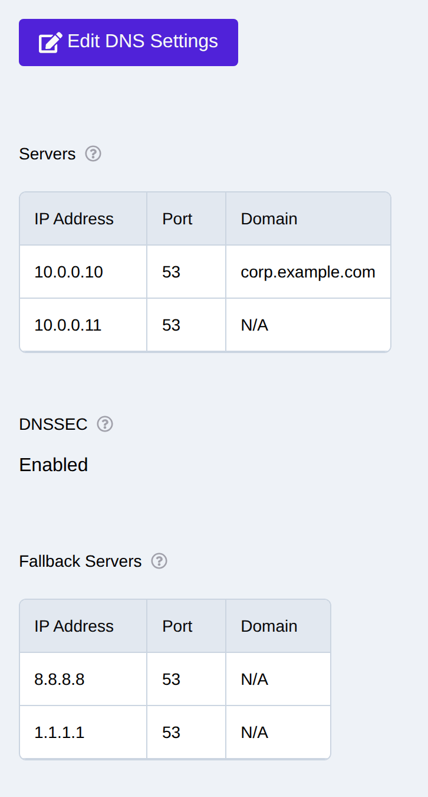

.. _security_configuration:

Security Configuration
======================

The eShield-Q Gateway supports optional security features that are recommended for production networks.

.. _confidential_vm:

Confidential VM Support
-----------------------
eShield-Q Gateway supports deployment in a Confidential VM (AMD SEV & SEV-SNP) environment.
Confidential VMs encrypt the entire VM memory and provide robust protections for sensitive data.
Furthermore, most CSPs provide support for attestation of Confidential VMs to ensure that the VM is running in a secure environment.

Note: Confidential VMs will reduce the overall performance of the eShield-Q Gateway (sometimes significantly).

To launch the eShield-Q Gateway inside a Confidential VM select the correct VM size and region in AWS, Azure, and Google Cloud.:

AMD-SEV or AMD SEV-SNP machine sizes for AWS, Azure, and Google Cloud:

* AWS: (c6a, m6a, r6a) ex: c6a.2xlarge 
* Azure: (Das_v4, Dasv5) ex: Standard_D8as_v4, Standard_EC8ads_v5 
* Google  (n2d, c3d) ex: n2d-standard-8, c3d-highcpu-8

.. _vtpm_support:

vTPM Support
------------
eShield-Q Gateway supports using vTPM for disk encryption keys in AWS, Azure, and Google Cloud.

To launch a VM with a vTPM follow the below instructions or use the eShield-Q Gateway terraform modules.

* Azure: https://learn.microsoft.com/en-us/azure/virtual-machines/trusted-launch
* Google: https://cloud.google.com/compute/shielded-vm/docs/modifying-shielded-vm

.. _security_policy:

Security Policy Settings
------------------------
System-wide authentication policy is configured on the Web UI **System -> Security**
page (Security Settings section, or the REST API). The policy controls:

* **OTP enforcement** -- when enabled, every user must present a one-time
  password (MFA) at login, regardless of their individual OTP setting. It
  cannot be enabled while an active administrator has not enrolled a factor.
  A user who has not enrolled can still sign in, but the session reaches
  nothing except enrollment until they finish it.
* **Administrator-mediated enrollment** (``otp_enrollment_requires_admin_token``,
  on by default) -- a user enrolling from one of those enrollment-only sessions
  must also present a single-use code issued by an administrator, so a stolen
  password on its own cannot register an attacker's authenticator.
* **Auth token timeout** -- the longest an issued API/UI session token remains
  valid (default 30 minutes; accepted range 60 to 86400 seconds). A logout, a
  password change or a role change signs the session out sooner; this is the
  cap when none of those happen, so keep it short on a shared or remotely
  reachable appliance.
* **Password timeout** -- how long a password remains valid before it must be
  changed (default 90 days).
* **Login lockout** -- how many failed logins one client address may make
  against one account before the appliance stops checking the credential and
  answers ``429 Too Many Requests`` with a ``Retry-After`` header. Three
  settings: the **threshold** (default 5 failures, ``0`` disables the limiter),
  the **counting window** the failures must fall inside (default 900 s), and the
  **lockout duration** (default 300 s). Wrong passwords and wrong one-time
  passwords both count, on the login and change-password endpoints alike.

  A lockout applies to one **client address and account pair**, so an
  administrator locked out from one network can still log in from another, and
  nobody can lock a named administrator out from everywhere by guessing at the
  name. Attempts made while locked out are refused without being counted, so
  continued guessing cannot extend a lockout: it always ends the configured
  duration after the last real failed attempt. Set the threshold lower than any
  lockout policy on an upstream directory, or a spray locks the directory
  account before this limiter trips.

|

Using the REST API:

* Get the security policy: GET ``/api/auth/v1/settings``
* Set the security policy: POST ``/api/auth/v1/settings`` (``otp_enforce``,
  ``token_timeout_sec``, ``password_timeout_sec``,
  ``login_lockout_threshold``, ``login_lockout_window_sec``,
  ``login_lockout_duration_sec``)

.. note::
   ``POST /api/auth/v1/settings`` replaces the whole policy. Send every field,
   including the lockout settings, or the omitted ones revert to their
   defaults.

.. _audit_log:

Audit Log
---------
eShield-Q Gateway supports comprehensive logging for audit purposes. 

The audit log is accessible using the Web UI Monitoring -> Logs 
and using the REST API ``/api/sys/v1/logs/<log_name>`` endpoints.

Intrusion Detection and Prevention is based around a layered defense approach and includes multiple prevention and detection mechanisms.
The eShield-Q Gateway uses the following:

* Process Sandboxing (OS enforced using cgroups, SECCOMP filters, and namespaces)
* Integrity Measurement Architecture (IMA) - violations are logged as part of the audit log
* SELinux - violations are logged as part of the audit log
* Lockdown LSM - violations are reported comprehensively in the audit log
* Dataplane Acess Control List (ACL) Firewall - violations are reported comprehensively in the **Monitoring** pages

.. _tls_config:

Enable Certificate Based Authentication (Mutual TLS)
----------------------------------------------------
eShield-Q Gateway supports Certificate Based Authentication (Mutual TLS) to enhance the security of the HTTPS REST API.
When enabled for the system, the REST API will require client certificates in addition to the Password, and (optionally) a OTP for login.

The SSH user login is always Certificate based, while client side certificates for 
HTTPS REST API is optional - though recommended. 

Mutual TLS is configured on the Web UI **System -> Security** page (TLS section, or the
REST API). The available settings are ``ssl_verify_client`` (enable/disable
client-certificate verification) and ``ssl_verify_depth`` (the maximum
certificate chain depth accepted):

|

To Enable Client Certificate Authentication (Mutual TLS) for HTTPS:

* See :ref:`cert_generation` for Generating new client private keys and certificates
* Login as an administrator.
* Upload a client certificate via the POST ``/api/certs/v1/tls/client-cert`` endpoint
* Verify the certificate is in the list using the GET ``/api/certs/v1/tls/client-cert`` endpoint
* Enable Mutual TLS for the system using POST ``/api/sys/v1/tls_settings`` with the ``ssl_verify_client`` field set to ``on``

Now the client certificate is trusted by the system and must be provided in order to access the REST API.
If the client certificate is not provided, the eShield-Q Gateway will respond with a 400 error as shown below.

If using the python REST Client library, you can use the `cert` parameter to provide the Client Private Key and Certificate files for Authentication.

.. code-block:: python

    requests_kwargs["cert"] = (client_cert_file, client_key_file)
    requests.post(url, **requests_kwargs)

.. _https_certificates:

Custom HTTPS Certificates
-------------------------

By default, the eShield-Q Gateway uses a (self-signed) Certificate for HTTPS Authentication. 
Most Browsers will require adding a security exception to allow using self-signed certificates, 
and in general it is not recommended to use self-signed certificates in production networks.

The eShield-Q Gateway allows custom certificates to be used for HTTPS authentication.
As part of a secure network an eShield-Q Gateway administrator may use a Certificate Authority (CA) to sign the eShield-Q Gateway HTTPS certificate.
The CA Root Certificate can be used by client and browsers so that the eShield-Q Gateway can be authenticated. 

In order to use a custom signed HTTPS certificate, use the REST API:

* Generate a Certificate Authority Root Certificate and Private Key pair which will be used to sign the HTTPs Certificate
* Export a Certificate Signing Request: POST ``/api/certs/v1/signing_request`` see :ref:`cert_csr`

  * Set the `ip_addrs` field to include the Management Interface IP Address. 
  * Set the `dns_names` field to include the Management Interface DNS Name.
  * Note the eShield-Q Gateway generates a Private Key and exports the CSR for you to sign.

* Sign the CSR with the CA Root Private Key
* Upload the signed certificate to the eShield-Q Gateway via the POST ``/api/certs/v1/signed_csr`` endpoint with the `usage` field set to https_server
* Upon success the new HTTPS certificates will be used by the eShield-Q Gateway.
* Verify the HTTPS Server Certificate details using the GET ``/api/certs/v1/tls/server-cert`` endpoint

.. _syslog_configuration:

Syslog Configuration
--------------------
The eShield-Q Gateway uses industry standard Syslog formats for system event logging. 
A remote Syslog Server can be used to receive these events. 

Alternatively the System logs may be retrieved using the Web UI Monitoring -> Logs
and using the REST API ``/api/sys/v1/logs/<log_name>`` endpoints.

The Syslog server may be on a LAN or WAN network and must accessible to the eShield-Q Gateway over the Management Interface.

------------------------
Web UI Syslog Management
------------------------

The Web UI can be used to manage Syslog settings.

|

Remote Syslog setup is achieved via the REST API with a POST to ``/api/sys/v1/syslog/settings``.

* `server_address` field must be set to the IP address of the remote Syslog Server.
* `server_port` field must be set to the port of the remote Syslog Server.
* `enable_remote_syslog` field must be set to True to enable remote Syslog.
* (Optional *Recommended*) `enable_authentication` field is set to True to enable Syslog Authentication (see below).

------------------------------------
Syslog Authentication and Encryption
------------------------------------

Syslog Authentication and encryption over TLS is supported.

The eShield-Q Gateway allows certificates to be created and uploaded for Syslog authentication via the CSR mechanism.
An eShield-Q Gateway administrator may use a Certificate Authority (CA) to sign the eShield-Q Gateway Syslog certificate and 
must provide the CA certificate to the eShield-Q Gateway to allow mutual authentication.

The CA Root Certificate is uploaded via the REST API ``/api/certs/v1/syslog/ca`` endpoint and 
allows the eShield-Q Gateway to authenticate the Syslog Server.

In order to generate a Syslog client certificate, use the REST API:

* (*Pre*) Generate a Certificate Authority Root Certificate and Private Key pair which will be used to sign the Certificate
* Export a Certificate Signing Request: POST ``/api/certs/v1/signing_request``  see :ref:`cert_csr`
* Sign the CSR with the CA Root Private Key
* Upload the signed certificate to the eShield-Q Gateway via the POST ``/api/certs/v1/signed_csr`` endpoint with the `usage` field set to `SYSLOG_CLIENT`
* Verify the Certificate details using the GET ``/api/certs/v1/syslog/client-cert`` and ``/api/certs/v1/syslog/ca``
* Enable syslog authentication: POST ``/api/sys/v1/syslog/settings`` with the `enable_authentication` field set to True

.. _dns_config:

DNS Configuration
-----------------
The eShield-Q Gateway supports DNS configuration allowing for DNS based authentication (DNSSEC) and custom servers.

A list of servers and fallback_servers is configurable. 
Users specify a list of IP address, port and domains for DNS servers.

The default DNS servers are Cloudflare and Google:

* 1.1.1.1
* 1.0.0.1
* 8.8.8.8
* 8.8.4.4

The Web UI can be used to manage DNS settings.

|

**DNSSEC** can be enabled from the DNS settings (the ``dnssec`` field). When
enabled, the resolver validates DNSSEC signatures on DNS responses.

The REST API can be used to configure DNS:

* Get DNS settings: GET ``/api/sys/v1/dns/settings``
* Set DNS settings (``servers``, ``fallback_servers``, ``dnssec``): POST ``/api/sys/v1/dns/settings``
* Get resolver status: GET ``/api/sys/v1/dns/status``

Once Security is configured, the eShield-Q Gateway can be used to setup IPSec connections see :ref:`ipsec_setup`

