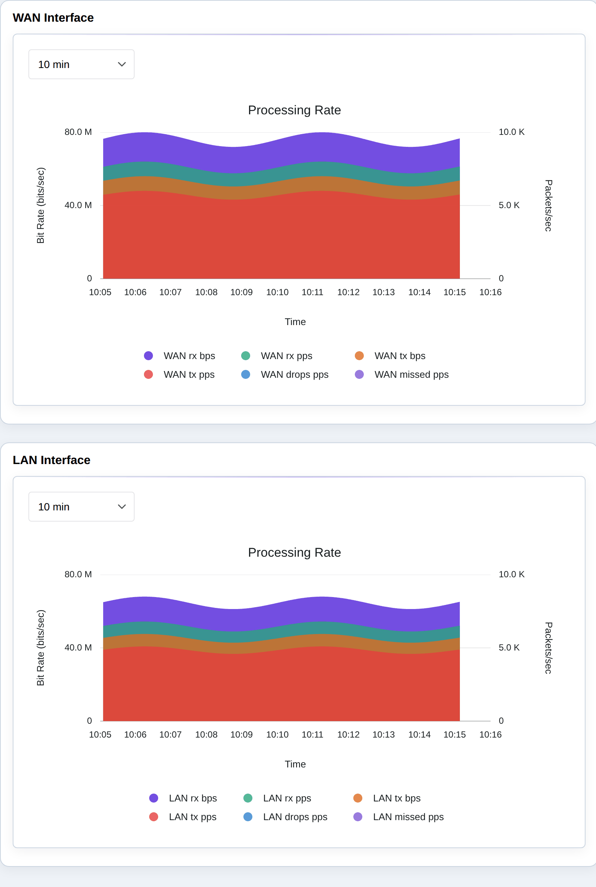
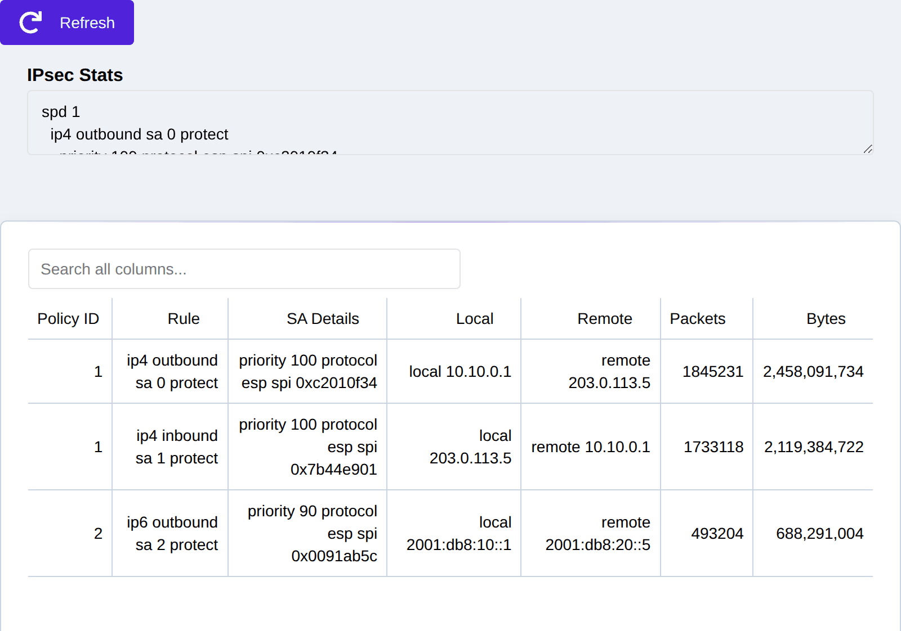
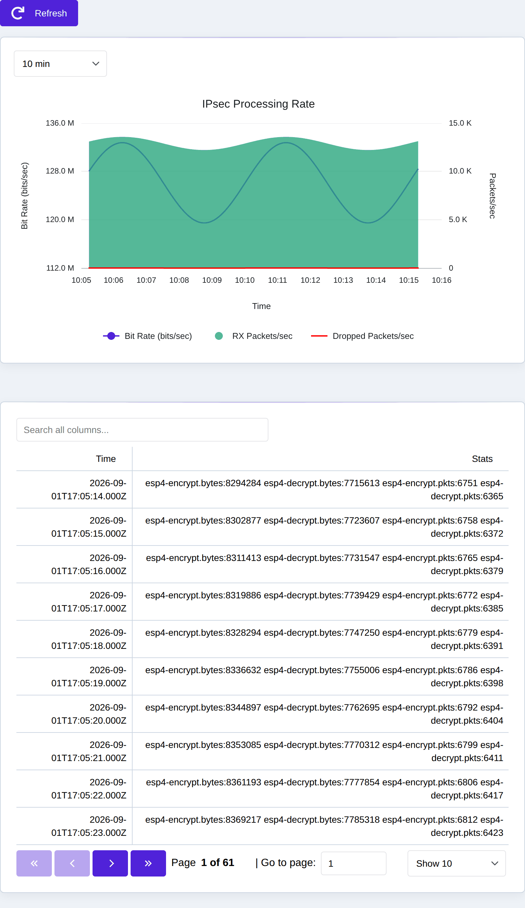
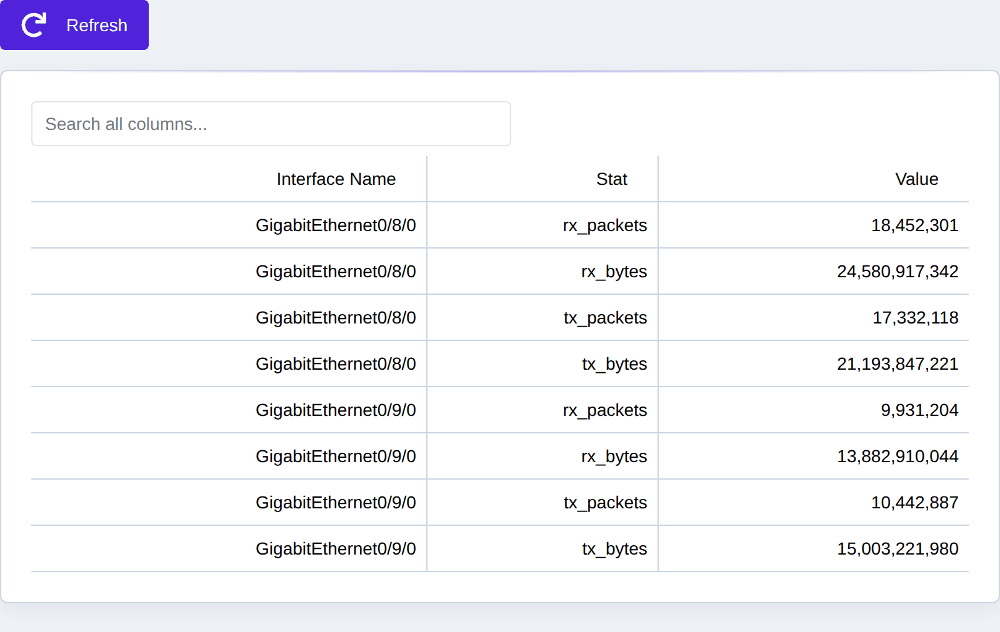
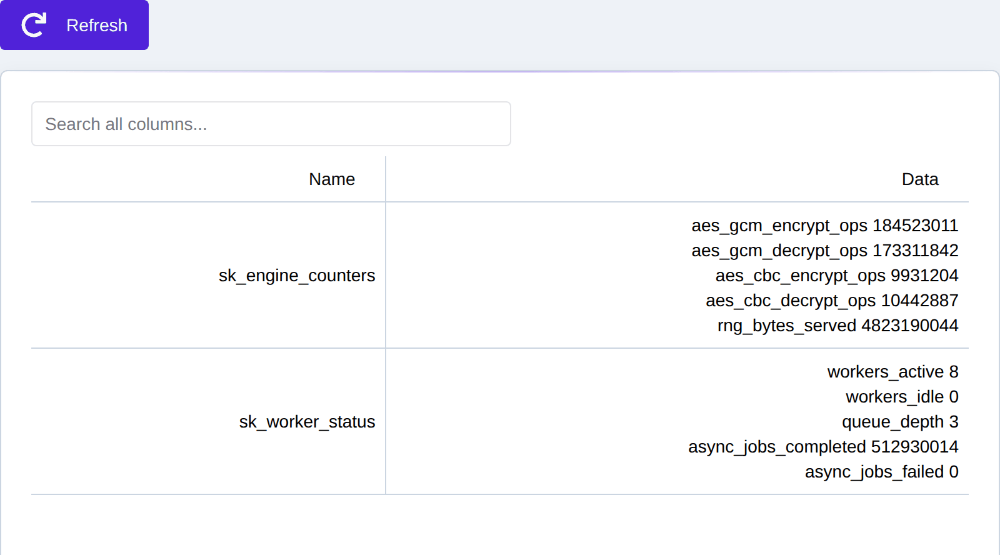
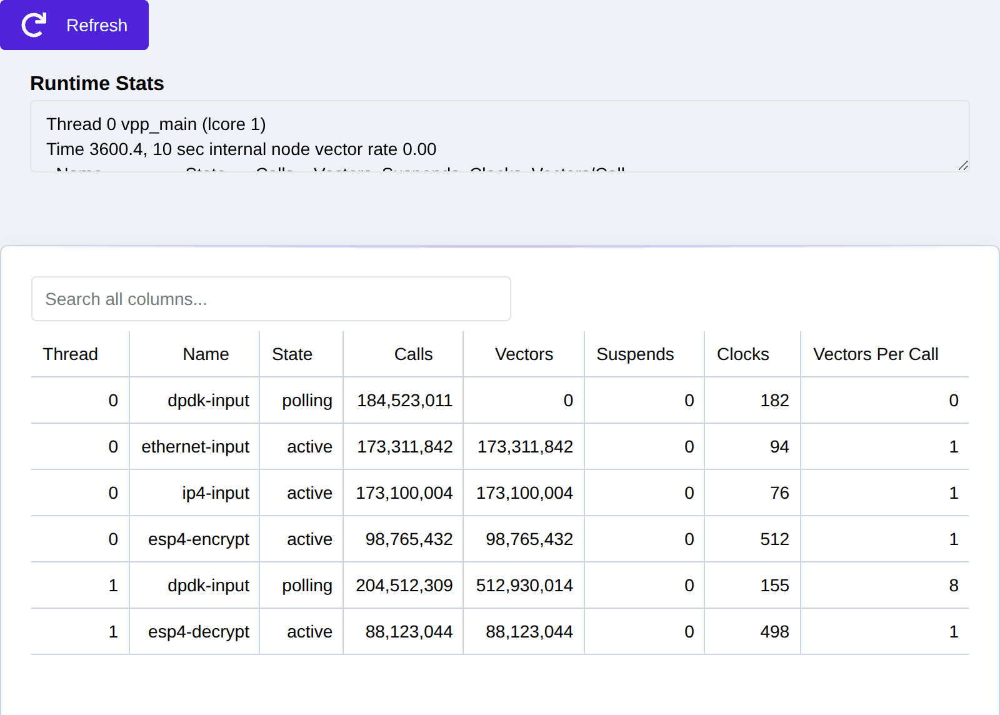
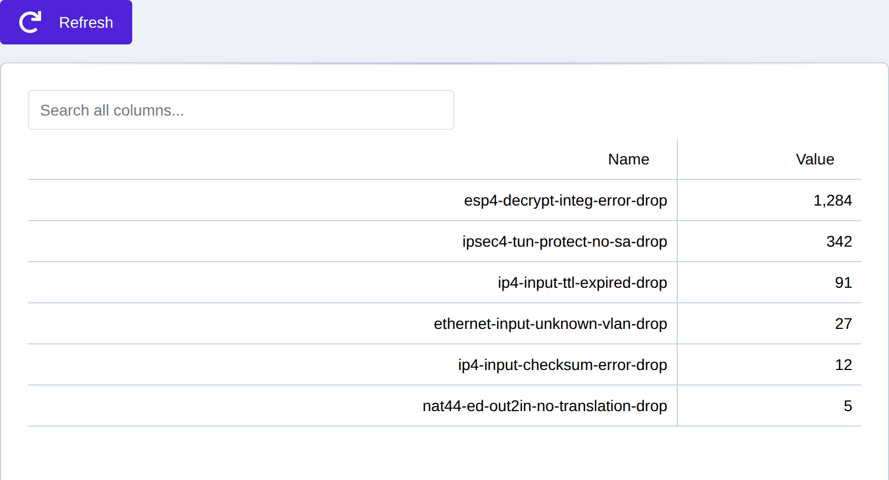

.. _statistics:

Statistics
==========

The eShield-Q Gateway reports dataplane and system statistics through the Web UI
**Monitoring** section (in the left navigation) and the REST API. Counter-based
views (interfaces, IPsec, errors) render as live time-series charts that poll
periodically; text views (IPsec detail, runtime) show the underlying dataplane
counters directly. In the Web UI these views are grouped under **Monitoring**:
**Traffic**, **IPsec**, and **System Counters** (which collects the Hardware,
Crypto, Runtime, and Error counters on one page).

Each statistics view has a matching REST endpoint under ``/api/stats/v1`` (the
error counters use ``/api/stats/v2/errors``). The Python client exposes the same
data via ``eshieldq.gateway.client`` ``show_stats_*`` helpers.

.. _stats_interfaces:

Interface Counters
------------------

The **Monitoring -> Traffic** page charts per-interface receive/transmit rates (bytes and
packets per second) for each WAN/LAN/management interface, derived from the
interface counter history.

|

REST API: GET ``/api/stats/v1/iface`` (current) and
GET ``/api/stats/v1/history/iface`` (time series).

.. _stats_ipsec:

IPsec Statistics
----------------

The **Monitoring -> IPsec** page (Statistics section) shows the current dataplane IPsec counters — security-policy
and security-association packet/byte counts per tunnel:

|

The **Monitoring -> IPsec** page (History section) charts IPsec throughput and drop rates over time:

|

REST API: GET ``/api/stats/v1/ipsec`` (current),
GET ``/api/stats/v1/history/ipsec`` and GET ``/api/stats/v1/history/sas``
(time series).

.. _stats_hardware:

Hardware Statistics
-------------------

The **Monitoring -> System Counters** page (Hardware section) reports NIC/hardware interface counters (per-queue and
per-interface packet/byte/error/drop counts):

|

REST API: GET ``/api/stats/v1/hw`` (all) and GET ``/api/stats/v1/hw/<iface>``.

.. _stats_crypto:

Crypto Statistics
-----------------

The **Monitoring -> System Counters** page (Crypto section) reports SecureKey crypto-engine counters (operations,
offload/queue depth, and errors) used to observe dataplane cryptographic
throughput:

|

REST API: GET ``/api/stats/v1/crypto``.

.. _stats_runtime:

Runtime Statistics
------------------

The **Monitoring -> System Counters** page (Runtime section) reports the dataplane graph-node runtime (per-node vectors,
clocks, and calls per worker thread) — useful for diagnosing where dataplane CPU
time is spent:

|

REST API: GET ``/api/stats/v1/runtime``.

.. _stats_errors:

Error Counters
--------------

The **Monitoring -> System Counters** page (Errors section) reports dataplane error and drop counters, including ACL
deny-drops (see :ref:`view_acl_stats`) and other packet-processing errors:

|

REST API: GET ``/api/stats/v2/errors``, with a time series at
GET ``/api/stats/v1/history/errors``.

Next Steps
----------
Troubleshooting using statistics see :ref:`troubleshooting`.
