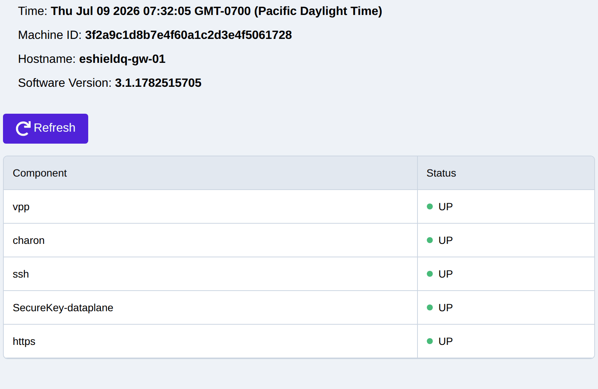
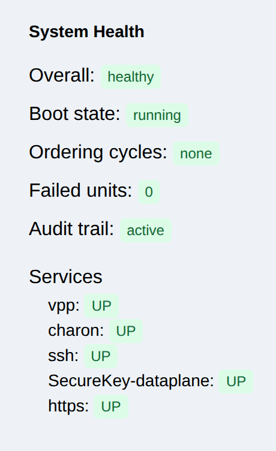
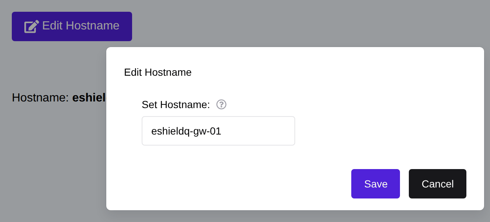
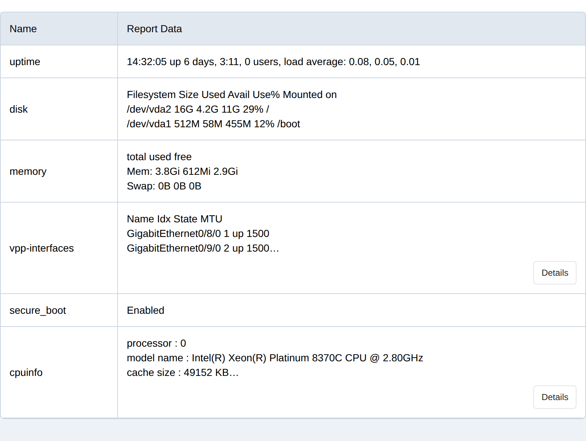
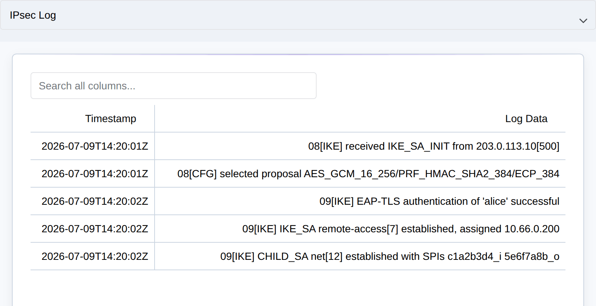

.. _system_monitoring:

System Monitoring
=================

.. _syslog_monitoring:

Setup Syslog
------------

Syslog is used for system event logging see :ref:`syslog_configuration`.

.. _system_enpoints:

    
Web UI System Monitoring
------------------------

The Web UI **System** page is used to monitor overall status and to perform
system administration. The **System -> Status & Health** page (Status section) shows the state of each major
sub-system (VPP dataplane, charon IKE daemon, SSH, SecureKey dataplane, HTTPS),
the machine ID, software version, and system time:

|

The **System -> Status & Health** page (Health section) reports systemd unit health — whether the system is running
cleanly and any failed or degraded services:

|

.. _hostname_config:

Hostname
--------

The system hostname is set from the **System -> Services** page (Hostname section) (or the REST
API). The hostname appears in the management TLS certificate and in log entries.

|

.. _system_reboot:

Reboot
------

The gateway can be rebooted from the **System -> Maintenance** page (Reboot section). A reboot is
required to complete some operations (software updates, interface role changes):

|

.. _system_report:

System Report
-------------

The **System -> Status & Health** page (System Report section) produces a diagnostics report summarising
security-relevant settings and open ports, useful when reporting an issue:

|

System Monitoring API
---------------------

The REST API ``/api/sys/v1/`` endpoints retrieve information about the system
state, including security-relevant information. Log in as an administrator to
access all system endpoints:

* GET ``/api/sys/v1/status`` returns the current status for all major sub-systems
* GET ``/api/sys/v1/health`` returns systemd unit health (running/failed units)
* GET ``/api/sys/v1/system-report`` includes information about security settings and open ports
* GET ``/api/sys/v1/time`` returns the current system time
* GET ``/api/sys/v1/version`` returns the system software version
* GET ``/api/sys/v1/machine-id`` returns the unique identifier for the machine
* GET ``/api/sys/v1/hostname`` returns the system hostname; POST to set it
* POST ``/api/sys/v1/reboot`` to reboot the system immediately

Software update endpoints: see :ref:`updates`.
System endpoints for TLS settings: see :ref:`tls_config`.
System endpoints for syslog settings: see :ref:`syslog_configuration`.
System endpoints for DNS: see :ref:`dns_config`.

.. _system_logs:

System Logs 
-----------

The Web UI can be used to retrieve System Log Files from Monitoring -> Logs:

System Logs can be retrieved using the REST API. Each log stream has its own
endpoint under ``/api/sys/v1/logs/``:

* Get a system log: GET ``/api/sys/v1/logs/<log_name>`` where ``<log_name>`` is
  one of ``audit``, ``ipsec``, ``ssh``, ``http-access``, ``rest-api``,
  ``swupdate``, ``user-auth``, ``crypto``, or ``eaas``.

The ``audit`` log records security-relevant events (see :ref:`audit_log`).

.. note::
  The logs may be rotated if they grow too large and need to be trimmed.
  The default log size is 10MB, if any log is larger than 10MB it will be trimmed.

  Syslog is the most common way of logging system events and
  is recommended for production systems.

System Statistics
-----------------
System and dataplane statistics (interface counters, IPsec throughput, hardware,
crypto, runtime, and error counters) are available on the **Monitoring** pages and
the ``/api/stats`` API. See :ref:`statistics`.

