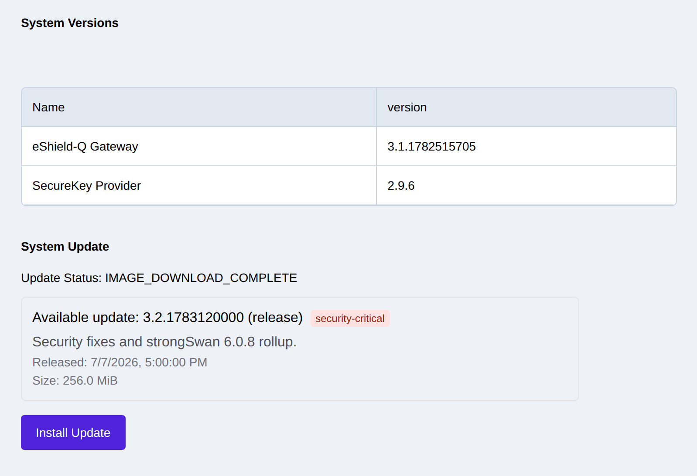

.. _updates:

Software Updates
================

.. _update_check:

Check for and Install Software Updates
--------------------------------------
Software updates are made available for the eShield-Q Gateway as features are added and bugs are fixed.

The eShield-Q Gateway can check for updates and download available software updates using the eShield-Q Gateway Management Interface.
The eShield-Q Gateway must be connected to the internet for software updates to be installed. 

The REST API or Web UI may be used to manage SW updates.

A reboot is required to complete all software updates.

The installed release is reported by ``GET /api/sys/v1/version``.

The Web UI System -> Maintenance page displays the current versions and allows the user to check for and install updates:

|

0. Backup the system configuration(s).
1. Check for updates: POST `/api/sys/v1/swupdate-check`
2. Get the status of the SWupdate check: GET  `/api/sys/v1/swupdate-check-status`
3. The Status will indicate that a new image has been downloaded (or that no update is available)
4. To install the new image: POST `/api/sys/v1/swupdate-install`
5. Poll the same status endpoint to track install progress: GET ``/api/sys/v1/swupdate-check-status`` (it reports the current SWupdate state, including install progress)
6. Once installation is successful the system must be rebooted
7. Reboot the system: POST `/api/sys/v1/reboot`
8. After reboot check the version: GET `/api/sys/v1/version`
9. If any failures occur check the SW update logs: GET `/api/sys/v1/logs/swupdate`

Software Update Security
------------------------
The eShield-Q Gateway uses authenticated and encrypted SW update images. 
Software images are retrieved using TLS over HTTPS to a private network of Content Delivery Servers.
The image is authenticated, decrypted and installed on the eShield-Q Gateway VM.

The eShield-Q Gateway uses a dual bank root filesystem to store the SW updates which mitigates risks associated with update failures.
If a failure were to occur during the install process (due to power failure or unexpected reboot), the software will revert back to the old version and the SW update process can be retried.

It is recommended to backup the configuration of the system prior to installing updates.

