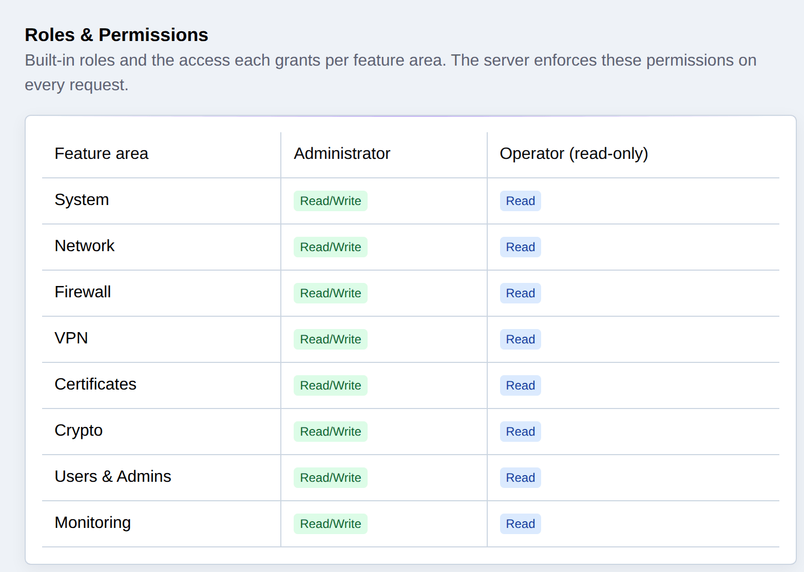
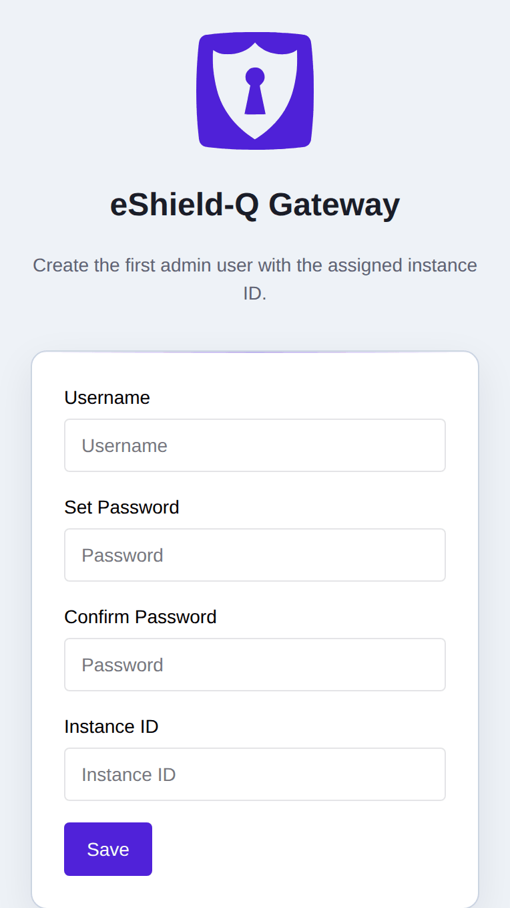
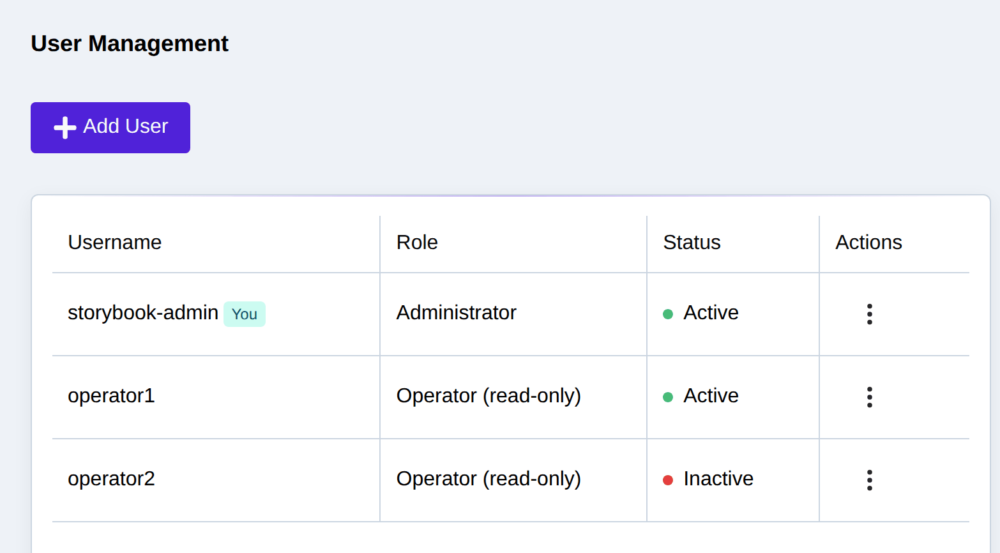
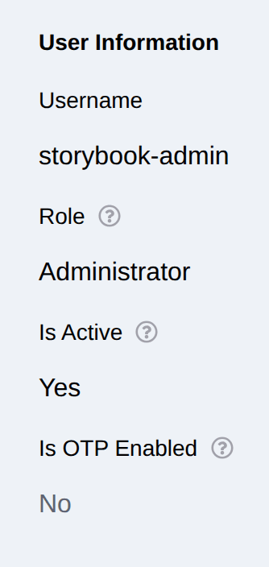
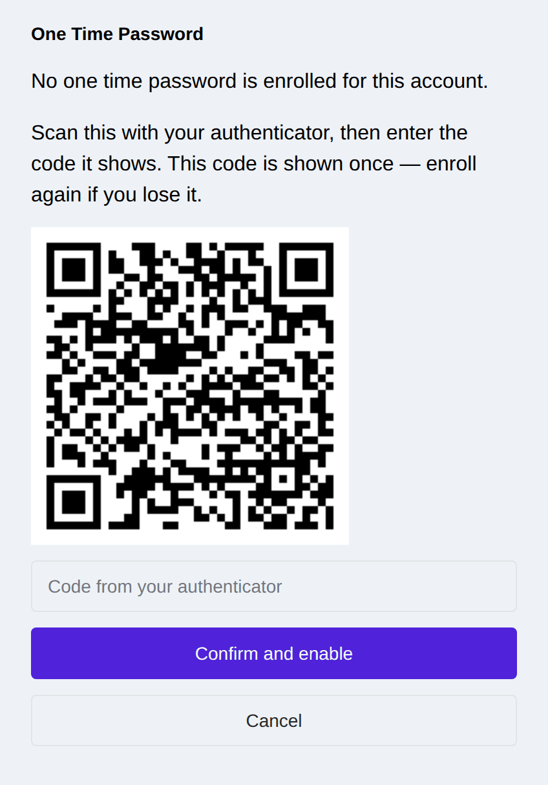
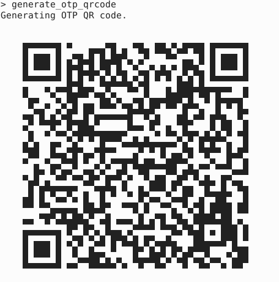
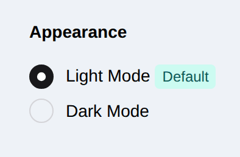
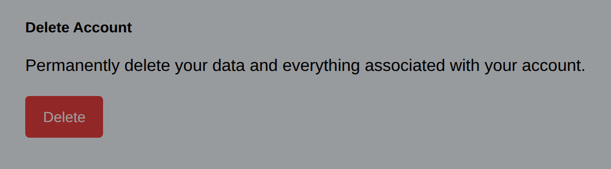

.. _user_management:

User Management
===============

The eShield-Q Gateway supports user management via the REST API and CLI. The users created can login using a username + password 
via the CLI or the REST API.

Each user has a **role** that determines what they are allowed to do. Passwords must be 14
characters or more and meet the minimum complexity requirements.

Multi-Factor Authentication can be enabled for any user account. The system security policy can be set to enforce MFA by all users.

.. _roles_and_permissions:

Roles and Permissions
---------------------

The eShield-Q Gateway provides two built-in roles:

* **Administrator** (``admin``) -- full read/write access to all device configuration, including
  user management and security settings. Administrators can add and remove users and perform all
  other tasks on the gateway.
* **Operator** (``operator``) -- a read-only role intended for monitoring. An operator can view
  device settings, configuration, and statistics through the same Web UI pages an administrator
  sees, but cannot make any changes. In the Web UI, configuration controls (create / edit / delete
  buttons and forms) are disabled for operators, and any attempt to modify configuration through
  the API is rejected with an HTTP ``403 Forbidden`` response.

Regardless of role, every user can manage their own account -- profile, password, and MFA settings.

What an operator can and cannot do:

.. list-table::
   :header-rows: 1
   :widths: 40 30 30

   * - Area
     - Administrator
     - Operator
   * - System, network, firewall (ACL), VPN, certificates, crypto -- *view* config and statistics
     - Yes
     - Yes (read-only)
   * - Changing any of the above configuration
     - Yes
     - No
   * - User management (add / remove users, SSH users)
     - Yes
     - No
   * - Security settings (MFA enforcement, token / password timeouts)
     - Yes
     - No
   * - Authentication, SSH, and audit logs
     - Yes
     - No

The role is selected when a user is created (see :ref:`adding_users`). The initial user is always
an administrator.

Permissions are organised as a matrix of **feature area** (system, network,
firewall, VPN, certificates, crypto, user/admin management, and monitoring) by
**access level** (none, read, or read-write). The built-in roles map to this
matrix as follows: an administrator has read-write access to every area; an
operator has read access to every area **except** user/admin management (which
includes user management, security settings, and authentication/audit logs),
where the operator has no access. The current role-to-area matrix is shown on
the Web UI **System -> Users & Access (Roles)** page and via the REST API GET ``/api/users/v1/roles``:

|

.. _initial_user:

Adding an Initial User
----------------------

The eShield-Q Gateway requires an initial user to be setup before any other functionality can be enabled.
The initial user must be an administrator and should be set following the instructions below. 
The REST API and CLI both support creation of the initial user.
Initial User Creation is a one time process and must be completed before any other functionality is enabled.

Initial user creation requires supplying the Instance ID.
This secures the initial user creation process as Instance ID is known only to the VM owner.

From the Web UI:

To create the initial user, enter at least one character in the username and password fields then select 'login' - the values used for this do not matter since there are no users yet.
Enter the details for the initial user as below:

From the REST API:

* Use the ``/api/users/v2/initial`` endpoint to create an initial user
* This user is an administrator and these credentials should be used to add other users.
* Login with the username and password using the ``/api/auth/v2/token`` endpoint.

From the CLI:

* If an initial user does not exist the CLI will prompt for creation of an initial user.
* Provide the username and password for the initial administrator.
* Login with the username and password.

User Management
---------------

The Web UI allows administrators to manage users and user account settings.

Access User Management from the System -> Users & Access page:

|

User Settings including Profile, Password Changes, and OTP settings are available
from the **My Account** page, reached either from the user menu in the top bar or
from **System -> My Account** in the sidebar. In the Password section, **Change
Password** opens the form in a dialog; a successful change signs the session out.

|

.. _adding_users:

------------
Adding Users
------------

From the REST API:

* Login with an administrator user.
* Use the ``/api/users/v1/register`` endpoint to create a new user.
* Provide the username and password and the desired role (``admin`` or ``operator``).

From the CLI:

* Login with an administrator user.
* Use the ``add_user`` command to create a new user.
* Provide the username and password and the desired role.

--------------------
Change User Password
--------------------

From the REST API:

* Login with as a user.
* Use the ``/api/auth/v1/change-password`` endpoint to change the password for the current user.
* Provide the current username and password and the new password.

From the CLI:

* Login as a user.
* Use the ``change_password`` command to change the password for the current user.
* Provide the current username and password and the new password.

A successful password change ends every session already open for that account,
including the one that made the request -- log in again with the new password.
This is what makes a password change an effective response to a session you
believe has been stolen. An administrator resetting their **own** password from
**Users** keeps only the browser tab they did it from; every other session for
that account is signed out.

--------------
Removing Users
--------------

From the REST API:

* Login with an administrator user.
* DELETE ``/api/users/v1/<username>``

From the CLI:

* Login with an administrator user.
* Use the ``delete_user`` command to remove a user.
* Provide the username of the user to remove.

----------------------------------
Enable Multi-Factor Authentication
----------------------------------

eShield-Q Gateway supports Multi-Factor Authentication (MFA) for users via Timebased One-Time Password (TOTP).
The REST API and CLI can generate QRCodes which can be imported into Duo Security, Google Authenticator and other
MFA applications. Once enabled, users will be required to provide an OTP on login.

Web UI OTP settings are available on the **My Account** page (One-Time Password section):

|

.. important::

   The QR code is shown **once**, when you enroll. The appliance never returns
   the seed again. If you lose the authenticator, enroll again — that issues a
   new seed and retires the old one.

From the REST API:

* Sign in with your Username and Password.
* POST ``/api/auth/v1/otp/enroll`` with your current password. The response
  carries the ``otpauth://`` URI and a QR code, and an ``enrollment_id``.
* Use Duo Security or Google Authenticator to scan the QRCode.
* POST ``/api/auth/v1/otp/enable`` with the same password, the
  ``enrollment_id``, and a code from the authenticator. The factor is not
  active until this confirms it.
* Confirming ends every **other** session for the account and keeps the one
  that performed it. At your next login, provide the OTP in the
  ``/api/auth/v2/token`` ``client_secret`` field.

Replacing or removing the factor requires the current one-time password as
well as the password: POST ``/api/auth/v1/otp/disable`` with both.

From the CLI:

* Sign in with your Username and Password.
* Run ``enroll_otp`` and answer the prompts. The QR code is printed once.
* Use Duo Security or Google Authenticator to scan the QRCode.
* Enter the code the authenticator shows to confirm.
* Your session continues; other sessions for the account are ended. An OTP is
  required at your next login.
  

|

-------------------
Appearance / Theme
-------------------

The **My Account** page (Appearance section) selects the Web UI colour mode (light or
dark). This is a per-browser display preference and does not affect other users.

|

--------------
Delete Account
--------------

A user can delete their own account from the **My Account** page (Delete Account
section). Deletion requires an explicit confirmation and is irreversible.

|

.. note::
   The last administrator account cannot be removed — at least one administrator
   must always exist to manage the gateway.

.. _ssh_user_mgmt:

SSH User Management
-------------------
SSH users can be added allowing for SSH access to the eShield-Q Gateway. 

From the Web UI:

System -> Users & Access (SSH Users) allows administrators to manage SSH users.

From the REST API:

* Login with an administrator user.
* To add a new SSH user: POST `name` and `public_key` to the ``/api/users/v1/ssh`` endpoint.
* To delete an SSH user: DELETE ``/api/users/v1/ssh/<username>`` endpoint.
* To get all current SSH users: Get ``/api/users/v1/ssh/all`` endpoint.

.. note::
    SSH users are independent from the password based username(s) that are used to login to the CLI and REST API.
    SSH users access the command line interface via SSH with the ``ssh -i [keyfile] [ssh_user]@[hostname]`` command.

    Once the SSH user is authenticated (using SSH public key authentication), the user must login 
    via the CLI using a username + password (+ MFA if enabled). 
    see :ref:`user_management`.
    
    It is possible to use the same username for SSH and CLI/REST API but it is not required.

Next Steps:
Configure System Security see :ref:`security_configuration`

